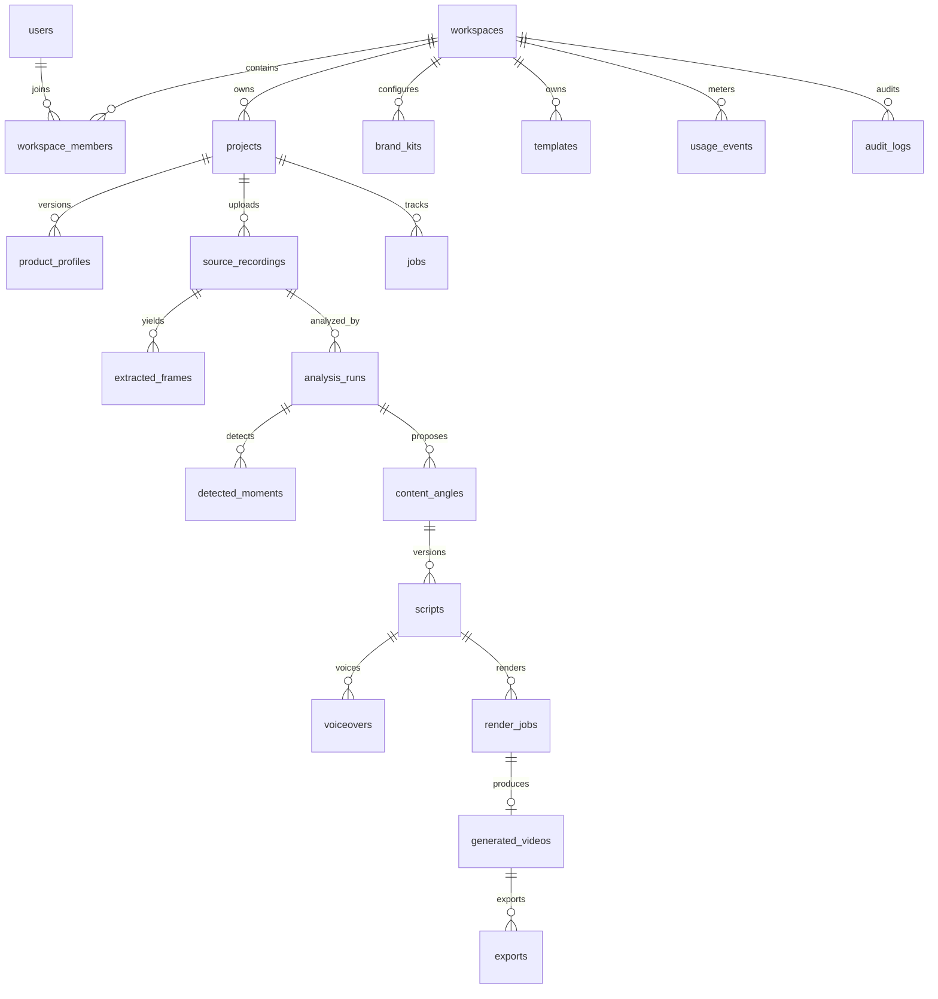

# Gideon database schema plan

**Database:** PostgreSQL

**ORM:** Prisma proposed for MVP

**Last updated:** 2026-06-29

## Conventions

- Primary keys are random UUIDs (`uuid`, generated UUIDv7/UUID4). External IDs are never sequential.
- Every tenant-owned row carries `workspace_id`, even if derivable through a parent, to make authorization and composite indexes explicit.
- Timestamps are `timestamptz` in UTC: `created_at`, `updated_at`, and optional lifecycle timestamps.
- Mutable user-edited records carry `revision integer default 1` for optimistic concurrency.
- Enumerations are PostgreSQL/Prisma enums for stable workflow states; provider-specific values remain strings/JSON.
- Large binary artifacts and large immutable JSON live in private object storage. Database stores object key, checksum, byte size, media type, and a query projection.
- JSONB is versioned with `schemaVersion`; it does not replace relational ownership, state, or foreign keys.
- Money/cost is integer micros in a named currency or provider-reported precise decimal; never floating point.
- Deletion access is revoked immediately with `deleted_at`; object purge runs asynchronously. Retention/legal exceptions are explicit.
- Foreign-key actions are chosen deliberately. Most project-owned content cascades after purge authorization; billing/audit events restrict or retain pseudonymized references.

## Implemented transition migrations

The current desktop/hosted-worker implementation still preserves full app-state snapshots for compatibility, but hosted PostgreSQL mode also writes queryable relational projections after successful store saves:

- `migrations/0001_hosted_jobs_artifacts.sql` creates `gideon_jobs` and `gideon_artifacts`.
- `migrations/0002_usage_audit_events.sql` creates `gideon_usage_events` and `gideon_audit_events`.
- `migrations/0003_core_identity_projects.sql` creates `gideon_users`, `gideon_workspaces`, `gideon_workspace_members`, `gideon_projects`, and `gideon_recording_upload_sessions`.

These transition tables intentionally keep `record_json jsonb not null` beside normalized ownership, status, billing, object, and list-query columns. The normalized columns make hosted operations queryable while preserving full record compatibility until the future hosted web/API surface reads and writes through fully relational service repositories.

## Entity relationship overview



## MVP classification

- **MVP required:** users, workspaces, workspace_members, projects, product_profiles, source_recordings, extracted_frames, analysis_runs, detected_moments, content_angles, scripts, voiceovers, jobs, render_jobs, generated_videos, exports, usage_events, audit_logs, outbox_events.
- **MVP minimal/future expanded:** brand_kits and templates exist with default/system records but advanced editing is future.
- **Future:** social_accounts, scheduled_posts, performance_metrics are specified only as extension notes/API placeholders and should not be migrated in MVP without implementation.

## Tables

### users — MVP

Identity profile linked to external authentication. Authentication secrets/passwords should remain with the auth provider unless a chosen auth library requires its own standard tables.

| Field | Type | Constraints/notes |
|---|---|---|
| `id` | uuid | PK, random |
| `auth_subject` | varchar(191) | unique, not null; stable provider subject |
| `email` | citext | unique where non-null; normalized |
| `email_verified_at` | timestamptz | nullable |
| `display_name` | varchar(120) | nullable |
| `avatar_url` | text | nullable; validated HTTPS/provider URL or proxied |
| `locale` | varchar(35) | not null default `en` |
| `timezone` | varchar(64) | not null default `UTC`; IANA identifier |
| `status` | user_status | `active`, `disabled`, `deleting` |
| `last_seen_at` | timestamptz | nullable |
| `created_at` / `updated_at` | timestamptz | not null |
| `deleted_at` | timestamptz | nullable |

Indexes/constraints:

- Unique `auth_subject`.
- Unique lower/CI email where non-null.
- Index `(status, created_at)` for operations.
- Never return `auth_subject` in public API.

### workspaces — MVP

Tenant, authorization, plan, and data boundary. MVP creates one personal workspace per user.

| Field | Type | Constraints/notes |
|---|---|---|
| `id` | uuid | PK |
| `name` | varchar(120) | not null |
| `slug` | citext | unique, nullable until exposed |
| `kind` | workspace_kind | `personal`, `team`, `agency` |
| `status` | workspace_status | `active`, `past_due`, `suspended`, `deleting` |
| `plan_code` | varchar(64) | not null default `mvp_free` |
| `billing_customer_id` | varchar(191) | nullable, unique where non-null |
| `billing_subscription_id` | varchar(191) | nullable, unique where non-null |
| `entitlements_json` | jsonb | versioned resolved entitlements snapshot |
| `data_region` | varchar(32) | nullable; future region pin |
| `retention_days` | integer | nullable; null = plan default, check 1..3650 |
| `created_by_user_id` | uuid | FK users, restrict |
| `created_at` / `updated_at` | timestamptz | not null |
| `deleted_at` | timestamptz | nullable |

Indexes/constraints:

- Unique slug and billing identifiers.
- Check retention bounds.
- Index `(status, plan_code)`.
- Deletion must account for retained usage/audit/billing records.

### workspace_members — MVP foundation

| Field | Type | Constraints/notes |
|---|---|---|
| `id` | uuid | PK |
| `workspace_id` | uuid | FK workspaces cascade |
| `user_id` | uuid | FK users cascade/restrict per deletion policy |
| `role` | workspace_role | `owner`, `admin`, `member`, `viewer` |
| `status` | member_status | `invited`, `active`, `suspended` |
| `invited_by_user_id` | uuid | nullable FK users |
| `joined_at` | timestamptz | nullable |
| `created_at` / `updated_at` | timestamptz | not null |

Indexes/constraints:

- Unique `(workspace_id, user_id)`.
- Index `(user_id, status)` for workspace list.
- Index `(workspace_id, role, status)`.
- Application/trigger rule: active workspace must retain at least one owner.

### projects — MVP

| Field | Type | Constraints/notes |
|---|---|---|
| `id` | uuid | PK |
| `workspace_id` | uuid | FK workspaces, not null |
| `name` | varchar(120) | not null; defaults from product name |
| `status` | project_status | `draft`, `uploading`, `analyzing`, `concept_review`, `script_review`, `rendering`, `ready`, `failed`, `archived`, `deleting` |
| `current_step` | project_step | `context`, `recording`, `analysis`, `concepts`, `scripts`, `videos` |
| `active_product_profile_id` | uuid | nullable FK product_profiles; add after cyclic migration |
| `active_recording_id` | uuid | nullable FK source_recordings; add after cyclic migration |
| `last_error_code` | varchar(80) | nullable safe code only |
| `revision` | integer | not null default 1 |
| `created_by_user_id` | uuid | FK users, restrict |
| `created_at` / `updated_at` | timestamptz | not null |
| `archived_at` / `deleted_at` | timestamptz | nullable |

Indexes/constraints:

- Index `(workspace_id, updated_at desc)` with `deleted_at is null` partial index.
- Index `(workspace_id, status, updated_at desc)`.
- Unique `(workspace_id, id)` to support composite tenant foreign keys where used.
- `revision > 0`.

### product_profiles — MVP

Immutable/versioned product context. A new version supersedes rather than overwrites a profile used by AI artifacts.

| Field | Type | Constraints/notes |
|---|---|---|
| `id` | uuid | PK |
| `workspace_id` | uuid | FK workspaces |
| `project_id` | uuid | FK projects cascade |
| `version` | integer | not null, starts 1 |
| `product_name` | varchar(80) | not null |
| `target_customer` | varchar(300) | not null |
| `product_description` | varchar(600) | not null |
| `preferred_tone` | tone_preset | direct, professional, casual, educational, bold |
| `tone_guidance` | varchar(300) | nullable |
| `platforms` | platform[] | not null |
| `claims_json` | jsonb | future approved claims/proof; versioned |
| `created_by_user_id` | uuid | FK users |
| `created_at` | timestamptz | not null |

Indexes/constraints:

- Unique `(project_id, version)`.
- Index `(workspace_id, project_id, created_at desc)`.
- Check nonblank/lengths at DB where practical; API performs richer validation.

### source_recordings — MVP

| Field | Type | Constraints/notes |
|---|---|---|
| `id` | uuid | PK |
| `workspace_id` | uuid | FK workspaces |
| `project_id` | uuid | FK projects cascade |
| `version` | integer | source replacement increments |
| `status` | recording_status | `initiated`, `uploading`, `uploaded`, `validating`, `verified`, `rejected`, `failed`, `deleting`, `deleted` |
| `original_filename` | varchar(255) | display only, sanitized/never path |
| `declared_media_type` | varchar(127) | nullable, untrusted hint |
| `detected_container` | varchar(32) | nullable |
| `video_codec` / `audio_codec` | varchar(32) | nullable |
| `object_key` | text | unique, private generated key |
| `bucket` | varchar(128) | not null/configured |
| `upload_id` | varchar(255) | nullable encrypted/limited access if stored |
| `size_bytes` | bigint | not null/check positive after upload |
| `checksum_sha256` | char(64) | nullable until verified |
| `duration_ms` | bigint | nullable/check 1..policy max |
| `width` / `height` | integer | nullable/check positive |
| `fps_num` / `fps_den` | integer | nullable/check positive denominator |
| `has_audio` | boolean | nullable until probe |
| `stream_count` | integer | nullable/check bounded |
| `probe_json_key` | text | nullable object artifact |
| `validation_error_code` | varchar(80) | nullable |
| `verified_at` | timestamptz | nullable |
| `created_by_user_id` | uuid | FK users |
| `created_at` / `updated_at` / `deleted_at` | timestamptz | lifecycle |

Indexes/constraints:

- Unique `(project_id, version)` and `object_key`.
- Index `(workspace_id, project_id, status)`.
- Optional same-workspace checksum index `(workspace_id, checksum_sha256)` where verified/not deleted.
- Do not deduplicate across workspaces.

### extracted_frames — MVP

| Field | Type | Constraints/notes |
|---|---|---|
| `id` | uuid | PK |
| `workspace_id` | uuid | FK workspaces |
| `project_id` | uuid | FK projects |
| `source_recording_id` | uuid | FK recording cascade |
| `analysis_run_id` | uuid | nullable FK analysis run |
| `timestamp_ms` | bigint | not null, within source duration |
| `kind` | frame_kind | `baseline`, `scene_change`, `transcript_boundary`, `user`, `qa` |
| `object_key` | text | unique private image |
| `checksum_sha256` | char(64) | not null |
| `width` / `height` | integer | not null |
| `change_score` | decimal(6,5) | nullable 0..1 |
| `ocr_text` | text | nullable, redacted/bounded |
| `ocr_json_key` | text | nullable large artifact |
| `created_at` | timestamptz | not null |

Indexes/constraints:

- Unique `(source_recording_id, timestamp_ms, kind)` where duplicate kind unnecessary.
- Index `(source_recording_id, timestamp_ms)`.
- Index `(analysis_run_id, kind, timestamp_ms)`.
- Object access always derives from authorized parent workspace.

### analysis_runs — MVP

One run binds exact profile/recording/prompt/model versions.

| Field | Type | Constraints/notes |
|---|---|---|
| `id` | uuid | PK |
| `workspace_id` | uuid | FK workspaces |
| `project_id` | uuid | FK projects cascade |
| `source_recording_id` | uuid | FK source_recordings restrict |
| `product_profile_id` | uuid | FK product_profiles restrict |
| `status` | run_status | canonical job statuses |
| `stage` | analysis_stage | inspect, extract, transcribe, summarize, moments |
| `prompt_version` | varchar(64) | not null |
| `provider` / `model` / `model_version` | varchar | nullable until used |
| `transcript_object_key` | text | nullable |
| `evidence_object_key` | text | nullable |
| `summary_json` | jsonb | nullable, schema-versioned bounded projection |
| `warnings_json` | jsonb | nullable |
| `input_hash` | char(64) | not null idempotency basis |
| `started_at` / `completed_at` | timestamptz | nullable |
| `created_by_user_id` | uuid | FK users |
| `created_at` / `updated_at` | timestamptz | not null |

Indexes/constraints:

- Index `(workspace_id, project_id, created_at desc)`.
- Unique active/completed reusable run by `(project_id, input_hash)` subject to policy.
- Check completion timestamps/status consistency in service/tests.

### detected_moments — MVP

| Field | Type | Constraints/notes |
|---|---|---|
| `id` | uuid | PK |
| `workspace_id` | uuid | FK workspaces |
| `project_id` | uuid | FK projects |
| `analysis_run_id` | uuid | FK analysis_runs cascade |
| `parent_moment_id` | uuid | nullable, links AI original to user revision |
| `version` | integer | not null default 1 |
| `source` | moment_source | `ai`, `user`, `ai_user_edited` |
| `label` | varchar(160) | not null |
| `observed_description` | text | not null/bounded |
| `inference` | text | nullable, kept separate |
| `start_ms` / `end_ms` | bigint | not null; start >=0, end > start |
| `confidence` | decimal(5,4) | nullable 0..1 |
| `is_key_proof` / `is_hidden` | boolean | defaults false |
| `evidence_frame_ids` | uuid[] or join table | MVP array acceptable; join preferred if queried |
| `transcript_excerpt` | text | nullable/bounded |
| `revision` | integer | optimistic editing |
| `created_by_user_id` | uuid | nullable for AI/system |
| `created_at` / `updated_at` | timestamptz | not null |

Indexes/constraints:

- Index `(analysis_run_id, start_ms)`.
- Index `(project_id, is_hidden, is_key_proof)`.
- Exclusion/overlap is allowed; range bounds validated against recording.

### content_angles — MVP

| Field | Type | Constraints/notes |
|---|---|---|
| `id` | uuid | PK |
| `workspace_id` | uuid | FK workspaces |
| `project_id` | uuid | FK projects |
| `analysis_run_id` | uuid | FK analysis_runs restrict |
| `batch_id` | uuid | groups exactly ten generated concepts |
| `ordinal` | smallint | 1..10 within batch |
| `format` | content_format | enumerated required formats |
| `title` | varchar(160) | not null |
| `hook_direction` | text | not null/bounded |
| `target_pain` | text | not null/bounded |
| `rationale` | text | not null/bounded |
| `platforms` | platform[] | not null |
| `estimated_duration_ms` | integer | 15s..60s default policy |
| `moment_ids` | uuid[] or join table | evidence references |
| `status` | angle_status | `proposed`, `selected`, `dismissed`, `superseded` |
| `generation_json` | jsonb | prompt/model/validation metadata |
| `revision` | integer | user brief edits |
| `created_by_user_id` | uuid | nullable system |
| `created_at` / `updated_at` | timestamptz | not null |

Indexes/constraints:

- Unique `(batch_id, ordinal)`.
- Index `(project_id, batch_id, status)`.
- Enforce maximum three selected per active batch transactionally in service; optional deferred trigger later.

### scripts — MVP

Versioned script/visual plan for one content angle.

| Field | Type | Constraints/notes |
|---|---|---|
| `id` | uuid | PK |
| `workspace_id` | uuid | FK workspaces |
| `project_id` | uuid | FK projects |
| `content_angle_id` | uuid | FK content_angles restrict |
| `version` | integer | starts 1 |
| `status` | script_status | `draft`, `needs_review`, `approved`, `superseded` |
| `hook_text` | text | not null/bounded |
| `voiceover_text` | text | not null/bounded |
| `cta_text` | text | nullable |
| `caption_cues_json` | jsonb | schema-versioned segments/words |
| `visual_beats_json` | jsonb | schema-versioned moment mapping |
| `overlay_cues_json` | jsonb | schema-versioned |
| `estimated_duration_ms` | integer | not null/check <=60000 |
| `prompt_version` / `provider` / `model` | varchar | generation provenance |
| `validation_json` | jsonb | prohibited phrase/evidence/diversity results |
| `revision` | integer | optimistic concurrency |
| `approved_by_user_id` | uuid | nullable FK users |
| `approved_at` | timestamptz | nullable |
| `created_by_user_id` | uuid | nullable |
| `created_at` / `updated_at` | timestamptz | not null |

Indexes/constraints:

- Unique `(content_angle_id, version)`.
- Index `(project_id, status, updated_at desc)`.
- Approved timestamp/user required when status approved (service + optional DB check).

### voiceovers — MVP

| Field | Type | Constraints/notes |
|---|---|---|
| `id` | uuid | PK |
| `workspace_id` | uuid | FK workspaces |
| `project_id` | uuid | FK projects |
| `script_id` | uuid | FK scripts restrict |
| `version` | integer | starts 1 |
| `status` | artifact_status | queued, processing, completed, failed, canceled, deleting |
| `provider` / `voice_id` / `model_version` | varchar | server-safe configured IDs/provenance |
| `locale` | varchar(35) | not null |
| `speaking_rate` | decimal(4,3) | bounded |
| `object_key` | text | nullable unique on completion |
| `checksum_sha256` | char(64) | nullable |
| `size_bytes` | bigint | nullable |
| `duration_ms` | integer | nullable |
| `timings_object_key` | text | nullable |
| `cost_micros` | bigint | nullable/nonnegative |
| `currency` | char(3) | nullable ISO |
| `error_code` | varchar(80) | nullable safe code |
| `created_at` / `updated_at` / `deleted_at` | timestamptz | lifecycle |

Indexes/constraints:

- Unique `(script_id, version)`.
- Index `(workspace_id, status, created_at)`.
- Completed requires object/checksum/duration.

### jobs — MVP

Generic durable job projection independent of BullMQ retention.

| Field | Type | Constraints/notes |
|---|---|---|
| `id` | uuid | PK, API job ID |
| `workspace_id` | uuid | FK workspaces |
| `project_id` | uuid | nullable FK projects |
| `kind` | job_kind | inspect, extract, transcribe, analysis, concepts, scripts, tts, render_preview, render_final, export, delete |
| `queue_name` | varchar(80) | not null |
| `status` | job_status | queued, processing, waiting_for_user, completed, failed, canceled |
| `stage` | varchar(80) | not null bounded enum by kind in code |
| `progress_current` / `progress_total` | bigint | nullable/nonnegative |
| `progress_unit` | varchar(32) | nullable |
| `attempt` / `max_attempts` | smallint | not null |
| `idempotency_key` | varchar(191) | not null |
| `input_json` | jsonb | bounded IDs/versions; no secrets/URLs |
| `result_json` | jsonb | bounded artifact IDs; no raw provider payload |
| `retryable` | boolean | nullable until error |
| `error_code` / `user_message` | varchar/text | nullable sanitized |
| `diagnostics_object_key` | text | nullable operator-only |
| `heartbeat_at` | timestamptz | nullable |
| `cancel_requested_at` | timestamptz | nullable |
| `started_at` / `completed_at` | timestamptz | nullable |
| `created_at` / `updated_at` | timestamptz | not null |

Indexes/constraints:

- Unique `(workspace_id, kind, idempotency_key)`.
- Index `(workspace_id, project_id, created_at desc)`.
- Index `(queue_name, status, created_at)`.
- Index `(status, heartbeat_at)` for stalled recovery/ops.
- State/timestamp validity checked by service and tests.

### render_jobs — MVP

Render-specific immutable inputs and QA projection; one-to-one with generic job by attempt or linked parent job.

| Field | Type | Constraints/notes |
|---|---|---|
| `id` | uuid | PK |
| `job_id` | uuid | unique FK jobs cascade |
| `workspace_id` | uuid | FK workspaces |
| `project_id` | uuid | FK projects |
| `script_id` | uuid | FK scripts restrict |
| `voiceover_id` | uuid | nullable FK voiceovers restrict |
| `template_id` | uuid | FK templates restrict |
| `brand_kit_id` | uuid | nullable FK brand_kits restrict |
| `profile` | render_profile | `preview_v1`, `short_vertical_v1` |
| `manifest_version` | varchar(32) | not null |
| `manifest_object_key` | text | not null |
| `manifest_hash` | char(64) | not null |
| `renderer_version` / `ffmpeg_version` | varchar | not null |
| `qa_status` | qa_status | pending, passed, failed, warning |
| `qa_json` | jsonb | bounded checks/result |
| `cost_micros` | bigint | nullable |
| `created_at` / `updated_at` | timestamptz | not null |

Indexes/constraints:

- Unique `(workspace_id, manifest_hash, profile)` for reusable completed result policy.
- Index `(project_id, created_at desc)`.
- Never reuse across workspaces even with identical hashes.

### generated_videos — MVP

| Field | Type | Constraints/notes |
|---|---|---|
| `id` | uuid | PK |
| `workspace_id` | uuid | FK workspaces |
| `project_id` | uuid | FK projects |
| `content_angle_id` | uuid | FK content_angles |
| `script_id` | uuid | FK scripts |
| `render_job_id` | uuid | unique FK render_jobs restrict |
| `version` | integer | user-visible draft version |
| `status` | video_status | `rendering`, `ready`, `stale`, `failed`, `deleting`, `deleted` |
| `profile` | render_profile | not null |
| `object_key` | text | unique private key |
| `thumbnail_object_key` | text | nullable |
| `checksum_sha256` | char(64) | not null |
| `size_bytes` | bigint | not null |
| `duration_ms` / `width` / `height` / `fps_num` / `fps_den` | integer/bigint | canonical output metadata |
| `video_codec` / `audio_codec` | varchar(32) | not null |
| `manifest_hash` | char(64) | not null |
| `stale_reason` | varchar(80) | nullable |
| `ready_at` | timestamptz | nullable |
| `created_at` / `updated_at` / `deleted_at` | timestamptz | lifecycle |

Indexes/constraints:

- Unique `(project_id, content_angle_id, version, profile)`.
- Index `(workspace_id, project_id, status, created_at desc)`.
- Ready requires valid object metadata/checksum and passed/warning QA according to policy.

### exports — MVP

Represents an export request/artifact and download history; signed URLs are never stored.

| Field | Type | Constraints/notes |
|---|---|---|
| `id` | uuid | PK |
| `workspace_id` | uuid | FK workspaces |
| `project_id` | uuid | FK projects |
| `generated_video_id` | uuid | FK generated_videos restrict |
| `status` | export_status | queued, processing, ready, failed, expired, deleting |
| `object_key` | text | private final/export key |
| `download_filename` | varchar(180) | sanitized disposition name |
| `checksum_sha256` | char(64) | nullable until ready |
| `size_bytes` | bigint | nullable |
| `expires_at` | timestamptz | nullable artifact lifecycle, not signed URL |
| `download_count` | integer | not null default 0 |
| `last_downloaded_at` | timestamptz | nullable |
| `created_by_user_id` | uuid | FK users |
| `created_at` / `updated_at` / `deleted_at` | timestamptz | lifecycle |

Indexes/constraints:

- Index `(workspace_id, project_id, created_at desc)`.
- Index `(status, expires_at)` for cleanup.
- A download audit may increment count transactionally; high-volume delivery can aggregate events later.

### brand_kits — MVP default, future editing

| Field | Type | Constraints/notes |
|---|---|---|
| `id` | uuid | PK |
| `workspace_id` | uuid | FK workspaces |
| `name` | varchar(120) | not null |
| `status` | config_status | active, archived |
| `is_default` | boolean | not null default false |
| `version` | integer | not null |
| `colors_json` | jsonb | schema-versioned safe color tokens |
| `typography_json` | jsonb | allowlisted self-hosted font IDs |
| `logo_object_key` | text | nullable private image |
| `caption_style_json` | jsonb | allowlisted preset overrides |
| `created_by_user_id` | uuid | FK users |
| `created_at` / `updated_at` | timestamptz | not null |

Indexes/constraints:

- Unique `(workspace_id, name, version)`.
- Partial unique `(workspace_id)` where `is_default=true` and active (implemented by SQL migration).
- MVP seeds system/default kit; advanced custom kit is future.

### templates — MVP system records, future custom

| Field | Type | Constraints/notes |
|---|---|---|
| `id` | uuid | PK |
| `workspace_id` | uuid | nullable; null = system template |
| `key` | varchar(100) | stable template key |
| `name` | varchar(120) | not null |
| `version` | integer | not null |
| `status` | template_status | draft, active, deprecated |
| `renderer` | varchar(32) | `remotion` |
| `component_key` | varchar(100) | server allowlist key, never user code |
| `manifest_schema_version` | varchar(32) | not null |
| `config_json` | jsonb | bounded defaults/capabilities |
| `created_by_user_id` | uuid | nullable |
| `created_at` / `updated_at` | timestamptz | not null |

Indexes/constraints:

- Unique `(workspace_id, key, version)` with null semantics handled by partial indexes.
- Active system template per key/version policy.
- Component keys resolve only inside deployed renderer registry.

### usage_events — MVP

Immutable metering ledger.

| Field | Type | Constraints/notes |
|---|---|---|
| `id` | uuid | PK |
| `workspace_id` | uuid | FK workspaces restrict/retain |
| `project_id` | uuid | nullable; retained/pseudonymized per deletion policy |
| `job_id` | uuid | nullable FK jobs set null/restrict |
| `kind` | usage_kind | upload_bytes, source_ms, asr_ms, llm_input_tokens, llm_output_tokens, tts_chars, tts_ms, render_ms, storage_byte_day, export_bytes, provider_cost |
| `quantity` | decimal(24,6) | nonnegative; signed adjustments use separate `direction` |
| `unit` | varchar(32) | not null |
| `direction` | usage_direction | reserve, consume, release, credit |
| `provider` / `model` | varchar | nullable |
| `cost_micros` | bigint | nullable/nonnegative |
| `currency` | char(3) | nullable |
| `idempotency_key` | varchar(191) | not null |
| `metadata_json` | jsonb | bounded/no content or secrets |
| `occurred_at` / `created_at` | timestamptz | not null |

Indexes/constraints:

- Unique `(workspace_id, idempotency_key)`.
- Index `(workspace_id, occurred_at desc)`.
- Index `(workspace_id, kind, occurred_at)`.
- Future monthly partition on `occurred_at`.

### audit_logs — MVP

Security/product audit events, content-free.

| Field | Type | Constraints/notes |
|---|---|---|
| `id` | uuid | PK |
| `workspace_id` | uuid | nullable for auth/system events |
| `actor_user_id` | uuid | nullable; FK users/set null |
| `actor_type` | actor_type | user, worker, system, support |
| `action` | varchar(100) | stable enum-like event name |
| `target_type` | varchar(80) | project, recording, script, video, export, workspace |
| `target_id` | uuid | nullable/pseudonymizable |
| `request_id` / `ip_hash` / `user_agent_hash` | varchar | nullable; no raw sensitive values unless policy requires |
| `result` | audit_result | success, denied, failed |
| `metadata_json` | jsonb | allowlisted diffs/IDs only; no transcript/script/prompt/URL |
| `created_at` | timestamptz | immutable |

Indexes/constraints:

- Index `(workspace_id, created_at desc)`.
- Index `(target_type, target_id, created_at desc)`.
- Index `(actor_user_id, created_at desc)`.
- Append-only DB permissions; updates/deletes limited to retention process.

### outbox_events — MVP

Transactional publication of jobs/domain events.

| Field | Type | Constraints/notes |
|---|---|---|
| `id` | uuid | PK |
| `workspace_id` | uuid | nullable |
| `aggregate_type` / `aggregate_id` | varchar/uuid | not null |
| `event_type` | varchar(100) | not null |
| `schema_version` | varchar(16) | not null |
| `payload_json` | jsonb | IDs/versions only, no secrets |
| `idempotency_key` | varchar(191) | unique |
| `available_at` | timestamptz | not null |
| `published_at` | timestamptz | nullable |
| `attempts` | integer | not null default 0 |
| `last_error_code` | varchar(80) | nullable |
| `created_at` | timestamptz | not null |

Indexes/constraints:

- Partial index `(available_at, created_at)` where `published_at is null`.
- Unique idempotency key.
- Cleanup published rows after retention window.

## Supporting relationship tables

Arrays of UUIDs are acceptable for an initial immutable JSON projection, but use join tables where referential integrity or querying matters:

- `moment_evidence_frames(moment_id, frame_id, ordinal)`.
- `angle_moments(content_angle_id, detected_moment_id, ordinal, purpose)`.
- `script_moments(script_id, detected_moment_id, beat_key)` if visual beat JSON querying is needed.

The recommended MVP implements the first two join tables to prevent dangling evidence references.

## Enums

Central enum values include:

- `job_status`: queued, processing, waiting_for_user, completed, failed, canceled.
- `platform`: tiktok, instagram_reels, youtube_shorts, linkedin, other.
- `content_format`: product_walkthrough, problem_solution, before_after, founder_demo, how_it_works, feature_highlight, launch_announcement, tutorial, customer_pain, pov, three_reasons, built_this_because, linkedin_professional, tiktok_casual, youtube_educational.
- `render_profile`: preview_v1, short_vertical_v1.
- `project_status`, `recording_status`, `script_status`, and other lifecycle enums as defined in tables.

Enum changes are additive first. Removing/renaming an enum requires a staged migration.

## Prisma-style schema draft

This draft captures core relations and constraints. SQL migrations must add partial indexes, check constraints, citext, and any exclusion constraints Prisma cannot express.

```prisma
generator client {
  provider = "prisma-client-js"
}

datasource db {
  provider = "postgresql"
  url      = env("DATABASE_URL")
}

enum JobStatus {
  queued
  processing
  waiting_for_user
  completed
  failed
  canceled
}

enum ProjectStatus {
  draft
  uploading
  analyzing
  concept_review
  script_review
  rendering
  ready
  failed
  archived
  deleting
}

enum RecordingStatus {
  initiated
  uploading
  uploaded
  validating
  verified
  rejected
  failed
  deleting
  deleted
}

enum WorkspaceRole {
  owner
  admin
  member
  viewer
}

enum ScriptStatus {
  draft
  needs_review
  approved
  superseded
}

enum VideoStatus {
  rendering
  ready
  stale
  failed
  deleting
  deleted
}

enum RenderProfile {
  preview_v1
  short_vertical_v1
}

model User {
  id              String            @id @default(uuid()) @db.Uuid
  authSubject     String            @unique @map("auth_subject") @db.VarChar(191)
  email           String?           @unique @db.Citext
  displayName     String?           @map("display_name") @db.VarChar(120)
  locale          String            @default("en") @db.VarChar(35)
  timezone        String            @default("UTC") @db.VarChar(64)
  createdAt       DateTime          @default(now()) @map("created_at") @db.Timestamptz(6)
  updatedAt       DateTime          @updatedAt @map("updated_at") @db.Timestamptz(6)
  deletedAt       DateTime?         @map("deleted_at") @db.Timestamptz(6)
  memberships     WorkspaceMember[]
  createdProjects Project[]         @relation("ProjectCreator")

  @@map("users")
}

model Workspace {
  id                    String            @id @default(uuid()) @db.Uuid
  name                  String            @db.VarChar(120)
  slug                  String?           @unique @db.Citext
  status                String            @default("active") @db.VarChar(32)
  planCode              String            @default("mvp_free") @map("plan_code") @db.VarChar(64)
  billingCustomerId     String?           @unique @map("billing_customer_id") @db.VarChar(191)
  billingSubscriptionId String?           @unique @map("billing_subscription_id") @db.VarChar(191)
  entitlementsJson      Json?             @map("entitlements_json") @db.JsonB
  createdByUserId       String            @map("created_by_user_id") @db.Uuid
  createdAt             DateTime          @default(now()) @map("created_at") @db.Timestamptz(6)
  updatedAt             DateTime          @updatedAt @map("updated_at") @db.Timestamptz(6)
  deletedAt             DateTime?         @map("deleted_at") @db.Timestamptz(6)
  members               WorkspaceMember[]
  projects              Project[]
  brandKits             BrandKit[]
  templates             Template[]
  usageEvents           UsageEvent[]
  auditLogs             AuditLog[]

  @@index([status, planCode])
  @@map("workspaces")
}

model WorkspaceMember {
  id          String        @id @default(uuid()) @db.Uuid
  workspaceId String        @map("workspace_id") @db.Uuid
  userId      String        @map("user_id") @db.Uuid
  role        WorkspaceRole @default(owner)
  status      String        @default("active") @db.VarChar(24)
  createdAt   DateTime      @default(now()) @map("created_at") @db.Timestamptz(6)
  updatedAt   DateTime      @updatedAt @map("updated_at") @db.Timestamptz(6)
  workspace   Workspace     @relation(fields: [workspaceId], references: [id], onDelete: Cascade)
  user        User          @relation(fields: [userId], references: [id], onDelete: Cascade)

  @@unique([workspaceId, userId])
  @@index([userId, status])
  @@map("workspace_members")
}

model Project {
  id                     String            @id @default(uuid()) @db.Uuid
  workspaceId            String            @map("workspace_id") @db.Uuid
  name                   String            @db.VarChar(120)
  status                 ProjectStatus     @default(draft)
  currentStep            String            @default("context") @map("current_step") @db.VarChar(32)
  revision               Int               @default(1)
  createdByUserId        String            @map("created_by_user_id") @db.Uuid
  createdAt              DateTime          @default(now()) @map("created_at") @db.Timestamptz(6)
  updatedAt              DateTime          @updatedAt @map("updated_at") @db.Timestamptz(6)
  archivedAt             DateTime?         @map("archived_at") @db.Timestamptz(6)
  deletedAt              DateTime?         @map("deleted_at") @db.Timestamptz(6)
  workspace              Workspace         @relation(fields: [workspaceId], references: [id], onDelete: Restrict)
  createdBy              User              @relation("ProjectCreator", fields: [createdByUserId], references: [id], onDelete: Restrict)
  productProfiles        ProductProfile[]
  sourceRecordings       SourceRecording[]
  analysisRuns           AnalysisRun[]
  detectedMoments        DetectedMoment[]
  contentAngles          ContentAngle[]
  scripts                Script[]
  voiceovers             Voiceover[]
  jobs                   Job[]
  renderJobs             RenderJob[]
  generatedVideos        GeneratedVideo[]
  exports                Export[]

  @@index([workspaceId, status, updatedAt(sort: Desc)])
  @@index([workspaceId, updatedAt(sort: Desc)])
  @@map("projects")
}

model ProductProfile {
  id                 String   @id @default(uuid()) @db.Uuid
  workspaceId        String   @map("workspace_id") @db.Uuid
  projectId          String   @map("project_id") @db.Uuid
  version            Int
  productName        String   @map("product_name") @db.VarChar(80)
  targetCustomer     String   @map("target_customer") @db.VarChar(300)
  productDescription String   @map("product_description") @db.VarChar(600)
  preferredTone      String   @map("preferred_tone") @db.VarChar(32)
  toneGuidance       String?  @map("tone_guidance") @db.VarChar(300)
  platforms          String[]
  createdAt          DateTime @default(now()) @map("created_at") @db.Timestamptz(6)
  project            Project  @relation(fields: [projectId], references: [id], onDelete: Cascade)

  @@unique([projectId, version])
  @@index([workspaceId, projectId, createdAt(sort: Desc)])
  @@map("product_profiles")
}

model SourceRecording {
  id                String          @id @default(uuid()) @db.Uuid
  workspaceId       String          @map("workspace_id") @db.Uuid
  projectId         String          @map("project_id") @db.Uuid
  version           Int
  status            RecordingStatus @default(initiated)
  originalFilename  String          @map("original_filename") @db.VarChar(255)
  objectKey         String          @unique @map("object_key")
  bucket            String          @db.VarChar(128)
  sizeBytes         BigInt          @map("size_bytes")
  checksumSha256    String?         @map("checksum_sha256") @db.Char(64)
  durationMs        BigInt?         @map("duration_ms")
  width             Int?
  height            Int?
  hasAudio          Boolean?        @map("has_audio")
  verifiedAt        DateTime?       @map("verified_at") @db.Timestamptz(6)
  createdAt         DateTime        @default(now()) @map("created_at") @db.Timestamptz(6)
  updatedAt         DateTime        @updatedAt @map("updated_at") @db.Timestamptz(6)
  deletedAt         DateTime?       @map("deleted_at") @db.Timestamptz(6)
  project           Project         @relation(fields: [projectId], references: [id], onDelete: Cascade)
  frames            ExtractedFrame[]
  analysisRuns      AnalysisRun[]

  @@unique([projectId, version])
  @@index([workspaceId, projectId, status])
  @@index([workspaceId, checksumSha256])
  @@map("source_recordings")
}

model ExtractedFrame {
  id                String          @id @default(uuid()) @db.Uuid
  workspaceId       String          @map("workspace_id") @db.Uuid
  projectId         String          @map("project_id") @db.Uuid
  sourceRecordingId String          @map("source_recording_id") @db.Uuid
  analysisRunId     String?         @map("analysis_run_id") @db.Uuid
  timestampMs       BigInt          @map("timestamp_ms")
  kind              String          @db.VarChar(32)
  objectKey         String          @unique @map("object_key")
  checksumSha256    String          @map("checksum_sha256") @db.Char(64)
  width             Int
  height            Int
  changeScore       Decimal?        @map("change_score") @db.Decimal(6, 5)
  ocrText           String?         @map("ocr_text")
  createdAt         DateTime        @default(now()) @map("created_at") @db.Timestamptz(6)
  sourceRecording   SourceRecording @relation(fields: [sourceRecordingId], references: [id], onDelete: Cascade)
  analysisRun       AnalysisRun?    @relation(fields: [analysisRunId], references: [id], onDelete: SetNull)

  @@index([sourceRecordingId, timestampMs])
  @@index([analysisRunId, kind, timestampMs])
  @@map("extracted_frames")
}

model AnalysisRun {
  id                String          @id @default(uuid()) @db.Uuid
  workspaceId       String          @map("workspace_id") @db.Uuid
  projectId         String          @map("project_id") @db.Uuid
  sourceRecordingId String          @map("source_recording_id") @db.Uuid
  productProfileId  String          @map("product_profile_id") @db.Uuid
  status            JobStatus       @default(queued)
  stage             String          @db.VarChar(48)
  promptVersion     String          @map("prompt_version") @db.VarChar(64)
  provider          String?         @db.VarChar(64)
  model             String?         @db.VarChar(128)
  summaryJson       Json?           @map("summary_json") @db.JsonB
  inputHash         String          @map("input_hash") @db.Char(64)
  createdAt         DateTime        @default(now()) @map("created_at") @db.Timestamptz(6)
  updatedAt         DateTime        @updatedAt @map("updated_at") @db.Timestamptz(6)
  project           Project         @relation(fields: [projectId], references: [id], onDelete: Cascade)
  sourceRecording   SourceRecording @relation(fields: [sourceRecordingId], references: [id], onDelete: Restrict)
  productProfile    ProductProfile  @relation(fields: [productProfileId], references: [id], onDelete: Restrict)
  frames            ExtractedFrame[]
  moments           DetectedMoment[]
  angles            ContentAngle[]

  @@index([workspaceId, projectId, createdAt(sort: Desc)])
  @@index([projectId, inputHash])
  @@map("analysis_runs")
}

model DetectedMoment {
  id                  String       @id @default(uuid()) @db.Uuid
  workspaceId         String       @map("workspace_id") @db.Uuid
  projectId           String       @map("project_id") @db.Uuid
  analysisRunId       String       @map("analysis_run_id") @db.Uuid
  label               String       @db.VarChar(160)
  observedDescription String       @map("observed_description")
  inference           String?
  startMs             BigInt       @map("start_ms")
  endMs               BigInt       @map("end_ms")
  confidence          Decimal?     @db.Decimal(5, 4)
  isKeyProof          Boolean      @default(false) @map("is_key_proof")
  isHidden            Boolean      @default(false) @map("is_hidden")
  revision            Int          @default(1)
  createdAt           DateTime     @default(now()) @map("created_at") @db.Timestamptz(6)
  updatedAt           DateTime     @updatedAt @map("updated_at") @db.Timestamptz(6)
  project             Project      @relation(fields: [projectId], references: [id], onDelete: Cascade)
  analysisRun         AnalysisRun  @relation(fields: [analysisRunId], references: [id], onDelete: Cascade)
  angleLinks          AngleMoment[]

  @@index([analysisRunId, startMs])
  @@index([projectId, isHidden, isKeyProof])
  @@map("detected_moments")
}

model ContentAngle {
  id                  String        @id @default(uuid()) @db.Uuid
  workspaceId         String        @map("workspace_id") @db.Uuid
  projectId           String        @map("project_id") @db.Uuid
  analysisRunId       String        @map("analysis_run_id") @db.Uuid
  batchId             String        @map("batch_id") @db.Uuid
  ordinal             Int           @db.SmallInt
  format              String        @db.VarChar(48)
  title               String        @db.VarChar(160)
  hookDirection       String        @map("hook_direction")
  targetPain          String        @map("target_pain")
  rationale           String
  platforms           String[]
  estimatedDurationMs Int           @map("estimated_duration_ms")
  status              String        @default("proposed") @db.VarChar(24)
  generationJson      Json?         @map("generation_json") @db.JsonB
  revision            Int           @default(1)
  createdAt           DateTime      @default(now()) @map("created_at") @db.Timestamptz(6)
  updatedAt           DateTime      @updatedAt @map("updated_at") @db.Timestamptz(6)
  project             Project       @relation(fields: [projectId], references: [id], onDelete: Cascade)
  analysisRun         AnalysisRun   @relation(fields: [analysisRunId], references: [id], onDelete: Restrict)
  momentLinks         AngleMoment[]
  scripts             Script[]
  generatedVideos     GeneratedVideo[]

  @@unique([batchId, ordinal])
  @@index([projectId, batchId, status])
  @@map("content_angles")
}

model AngleMoment {
  contentAngleId  String         @map("content_angle_id") @db.Uuid
  detectedMomentId String        @map("detected_moment_id") @db.Uuid
  ordinal         Int            @db.SmallInt
  purpose         String?        @db.VarChar(48)
  contentAngle    ContentAngle   @relation(fields: [contentAngleId], references: [id], onDelete: Cascade)
  detectedMoment  DetectedMoment @relation(fields: [detectedMomentId], references: [id], onDelete: Restrict)

  @@id([contentAngleId, detectedMomentId])
  @@unique([contentAngleId, ordinal])
  @@map("angle_moments")
}

model Script {
  id                  String       @id @default(uuid()) @db.Uuid
  workspaceId         String       @map("workspace_id") @db.Uuid
  projectId           String       @map("project_id") @db.Uuid
  contentAngleId      String       @map("content_angle_id") @db.Uuid
  version             Int
  status              ScriptStatus @default(needs_review)
  hookText            String       @map("hook_text")
  voiceoverText       String       @map("voiceover_text")
  ctaText             String?      @map("cta_text")
  captionCuesJson     Json         @map("caption_cues_json") @db.JsonB
  visualBeatsJson     Json         @map("visual_beats_json") @db.JsonB
  overlayCuesJson     Json         @map("overlay_cues_json") @db.JsonB
  estimatedDurationMs Int          @map("estimated_duration_ms")
  promptVersion       String       @map("prompt_version") @db.VarChar(64)
  provider            String?      @db.VarChar(64)
  model               String?      @db.VarChar(128)
  validationJson      Json?        @map("validation_json") @db.JsonB
  revision            Int          @default(1)
  approvedAt          DateTime?    @map("approved_at") @db.Timestamptz(6)
  createdAt           DateTime     @default(now()) @map("created_at") @db.Timestamptz(6)
  updatedAt           DateTime     @updatedAt @map("updated_at") @db.Timestamptz(6)
  project             Project      @relation(fields: [projectId], references: [id], onDelete: Cascade)
  contentAngle        ContentAngle @relation(fields: [contentAngleId], references: [id], onDelete: Restrict)
  voiceovers          Voiceover[]
  renderJobs          RenderJob[]
  generatedVideos     GeneratedVideo[]

  @@unique([contentAngleId, version])
  @@index([projectId, status, updatedAt(sort: Desc)])
  @@map("scripts")
}

model Voiceover {
  id             String    @id @default(uuid()) @db.Uuid
  workspaceId    String    @map("workspace_id") @db.Uuid
  projectId      String    @map("project_id") @db.Uuid
  scriptId       String    @map("script_id") @db.Uuid
  version        Int
  status         JobStatus @default(queued)
  provider       String    @db.VarChar(64)
  voiceId        String    @map("voice_id") @db.VarChar(128)
  locale         String    @db.VarChar(35)
  objectKey      String?   @unique @map("object_key")
  checksumSha256 String?   @map("checksum_sha256") @db.Char(64)
  durationMs     Int?      @map("duration_ms")
  costMicros     BigInt?   @map("cost_micros")
  createdAt      DateTime  @default(now()) @map("created_at") @db.Timestamptz(6)
  updatedAt      DateTime  @updatedAt @map("updated_at") @db.Timestamptz(6)
  script         Script    @relation(fields: [scriptId], references: [id], onDelete: Restrict)
  renderJobs     RenderJob[]

  @@unique([scriptId, version])
  @@index([workspaceId, status, createdAt])
  @@map("voiceovers")
}

model Job {
  id                String      @id @default(uuid()) @db.Uuid
  workspaceId       String      @map("workspace_id") @db.Uuid
  projectId         String?     @map("project_id") @db.Uuid
  kind              String      @db.VarChar(48)
  queueName         String      @map("queue_name") @db.VarChar(80)
  status            JobStatus   @default(queued)
  stage             String      @db.VarChar(80)
  attempt           Int         @default(0) @db.SmallInt
  maxAttempts       Int         @map("max_attempts") @db.SmallInt
  idempotencyKey    String      @map("idempotency_key") @db.VarChar(191)
  inputJson         Json        @map("input_json") @db.JsonB
  resultJson        Json?       @map("result_json") @db.JsonB
  errorCode         String?     @map("error_code") @db.VarChar(80)
  userMessage       String?     @map("user_message")
  heartbeatAt       DateTime?   @map("heartbeat_at") @db.Timestamptz(6)
  cancelRequestedAt DateTime?   @map("cancel_requested_at") @db.Timestamptz(6)
  startedAt         DateTime?   @map("started_at") @db.Timestamptz(6)
  completedAt       DateTime?   @map("completed_at") @db.Timestamptz(6)
  createdAt         DateTime    @default(now()) @map("created_at") @db.Timestamptz(6)
  updatedAt         DateTime    @updatedAt @map("updated_at") @db.Timestamptz(6)
  project           Project?    @relation(fields: [projectId], references: [id], onDelete: Cascade)
  renderJob         RenderJob?

  @@unique([workspaceId, kind, idempotencyKey])
  @@index([workspaceId, projectId, createdAt(sort: Desc)])
  @@index([queueName, status, createdAt])
  @@index([status, heartbeatAt])
  @@map("jobs")
}

model RenderJob {
  id                String        @id @default(uuid()) @db.Uuid
  jobId             String        @unique @map("job_id") @db.Uuid
  workspaceId       String        @map("workspace_id") @db.Uuid
  projectId         String        @map("project_id") @db.Uuid
  scriptId          String        @map("script_id") @db.Uuid
  voiceoverId       String?       @map("voiceover_id") @db.Uuid
  templateId        String        @map("template_id") @db.Uuid
  profile           RenderProfile
  manifestVersion   String        @map("manifest_version") @db.VarChar(32)
  manifestObjectKey String        @map("manifest_object_key")
  manifestHash      String        @map("manifest_hash") @db.Char(64)
  qaStatus          String        @default("pending") @map("qa_status") @db.VarChar(24)
  qaJson            Json?         @map("qa_json") @db.JsonB
  createdAt         DateTime      @default(now()) @map("created_at") @db.Timestamptz(6)
  updatedAt         DateTime      @updatedAt @map("updated_at") @db.Timestamptz(6)
  job               Job           @relation(fields: [jobId], references: [id], onDelete: Cascade)
  project           Project       @relation(fields: [projectId], references: [id], onDelete: Cascade)
  script            Script        @relation(fields: [scriptId], references: [id], onDelete: Restrict)
  voiceover         Voiceover?    @relation(fields: [voiceoverId], references: [id], onDelete: Restrict)
  template          Template      @relation(fields: [templateId], references: [id], onDelete: Restrict)
  generatedVideo    GeneratedVideo?

  @@unique([workspaceId, manifestHash, profile])
  @@index([projectId, createdAt(sort: Desc)])
  @@map("render_jobs")
}

model GeneratedVideo {
  id              String        @id @default(uuid()) @db.Uuid
  workspaceId     String        @map("workspace_id") @db.Uuid
  projectId       String        @map("project_id") @db.Uuid
  contentAngleId  String        @map("content_angle_id") @db.Uuid
  scriptId        String        @map("script_id") @db.Uuid
  renderJobId     String        @unique @map("render_job_id") @db.Uuid
  version         Int
  status          VideoStatus   @default(rendering)
  profile         RenderProfile
  objectKey       String        @unique @map("object_key")
  checksumSha256  String        @map("checksum_sha256") @db.Char(64)
  sizeBytes       BigInt        @map("size_bytes")
  durationMs      Int           @map("duration_ms")
  width           Int
  height          Int
  manifestHash    String        @map("manifest_hash") @db.Char(64)
  readyAt         DateTime?     @map("ready_at") @db.Timestamptz(6)
  createdAt       DateTime      @default(now()) @map("created_at") @db.Timestamptz(6)
  updatedAt       DateTime      @updatedAt @map("updated_at") @db.Timestamptz(6)
  deletedAt       DateTime?     @map("deleted_at") @db.Timestamptz(6)
  project         Project       @relation(fields: [projectId], references: [id], onDelete: Cascade)
  contentAngle    ContentAngle  @relation(fields: [contentAngleId], references: [id], onDelete: Restrict)
  script          Script        @relation(fields: [scriptId], references: [id], onDelete: Restrict)
  renderJob       RenderJob     @relation(fields: [renderJobId], references: [id], onDelete: Restrict)
  exports         Export[]

  @@unique([projectId, contentAngleId, version, profile])
  @@index([workspaceId, projectId, status, createdAt(sort: Desc)])
  @@map("generated_videos")
}

model Export {
  id               String         @id @default(uuid()) @db.Uuid
  workspaceId      String         @map("workspace_id") @db.Uuid
  projectId        String         @map("project_id") @db.Uuid
  generatedVideoId String         @map("generated_video_id") @db.Uuid
  status           String         @default("queued") @db.VarChar(24)
  objectKey        String         @map("object_key")
  downloadFilename String         @map("download_filename") @db.VarChar(180)
  checksumSha256   String?        @map("checksum_sha256") @db.Char(64)
  sizeBytes        BigInt?        @map("size_bytes")
  expiresAt        DateTime?      @map("expires_at") @db.Timestamptz(6)
  downloadCount    Int            @default(0) @map("download_count")
  lastDownloadedAt DateTime?      @map("last_downloaded_at") @db.Timestamptz(6)
  createdAt        DateTime       @default(now()) @map("created_at") @db.Timestamptz(6)
  updatedAt        DateTime       @updatedAt @map("updated_at") @db.Timestamptz(6)
  project          Project        @relation(fields: [projectId], references: [id], onDelete: Cascade)
  generatedVideo   GeneratedVideo @relation(fields: [generatedVideoId], references: [id], onDelete: Restrict)

  @@index([workspaceId, projectId, createdAt(sort: Desc)])
  @@index([status, expiresAt])
  @@map("exports")
}

model BrandKit {
  id             String    @id @default(uuid()) @db.Uuid
  workspaceId    String    @map("workspace_id") @db.Uuid
  name           String    @db.VarChar(120)
  isDefault      Boolean   @default(false) @map("is_default")
  version        Int
  colorsJson     Json      @map("colors_json") @db.JsonB
  typographyJson Json      @map("typography_json") @db.JsonB
  createdAt      DateTime  @default(now()) @map("created_at") @db.Timestamptz(6)
  updatedAt      DateTime  @updatedAt @map("updated_at") @db.Timestamptz(6)
  workspace      Workspace @relation(fields: [workspaceId], references: [id], onDelete: Cascade)

  @@unique([workspaceId, name, version])
  @@map("brand_kits")
}

model Template {
  id                    String      @id @default(uuid()) @db.Uuid
  workspaceId           String?     @map("workspace_id") @db.Uuid
  key                   String      @db.VarChar(100)
  name                  String      @db.VarChar(120)
  version               Int
  status                String      @default("active") @db.VarChar(24)
  renderer              String      @default("remotion") @db.VarChar(32)
  componentKey          String      @map("component_key") @db.VarChar(100)
  manifestSchemaVersion String      @map("manifest_schema_version") @db.VarChar(32)
  configJson            Json        @map("config_json") @db.JsonB
  createdAt             DateTime    @default(now()) @map("created_at") @db.Timestamptz(6)
  updatedAt             DateTime    @updatedAt @map("updated_at") @db.Timestamptz(6)
  workspace             Workspace?  @relation(fields: [workspaceId], references: [id], onDelete: Cascade)
  renderJobs            RenderJob[]

  @@unique([workspaceId, key, version])
  @@map("templates")
}

model UsageEvent {
  id             String    @id @default(uuid()) @db.Uuid
  workspaceId    String    @map("workspace_id") @db.Uuid
  projectId      String?   @map("project_id") @db.Uuid
  kind           String    @db.VarChar(48)
  quantity       Decimal   @db.Decimal(24, 6)
  unit           String    @db.VarChar(32)
  direction      String    @db.VarChar(16)
  costMicros     BigInt?   @map("cost_micros")
  idempotencyKey String    @map("idempotency_key") @db.VarChar(191)
  occurredAt     DateTime  @map("occurred_at") @db.Timestamptz(6)
  createdAt      DateTime  @default(now()) @map("created_at") @db.Timestamptz(6)
  workspace      Workspace @relation(fields: [workspaceId], references: [id], onDelete: Restrict)

  @@unique([workspaceId, idempotencyKey])
  @@index([workspaceId, occurredAt(sort: Desc)])
  @@index([workspaceId, kind, occurredAt])
  @@map("usage_events")
}

model AuditLog {
  id          String     @id @default(uuid()) @db.Uuid
  workspaceId String?    @map("workspace_id") @db.Uuid
  actorUserId String?    @map("actor_user_id") @db.Uuid
  actorType   String     @map("actor_type") @db.VarChar(24)
  action      String     @db.VarChar(100)
  targetType  String     @map("target_type") @db.VarChar(80)
  targetId    String?    @map("target_id") @db.Uuid
  result      String     @db.VarChar(16)
  metadataJson Json?     @map("metadata_json") @db.JsonB
  createdAt   DateTime   @default(now()) @map("created_at") @db.Timestamptz(6)
  workspace   Workspace? @relation(fields: [workspaceId], references: [id], onDelete: Restrict)

  @@index([workspaceId, createdAt(sort: Desc)])
  @@index([targetType, targetId, createdAt(sort: Desc)])
  @@index([actorUserId, createdAt(sort: Desc)])
  @@map("audit_logs")
}

model OutboxEvent {
  id             String    @id @default(uuid()) @db.Uuid
  workspaceId    String?   @map("workspace_id") @db.Uuid
  aggregateType  String    @map("aggregate_type") @db.VarChar(64)
  aggregateId    String    @map("aggregate_id") @db.Uuid
  eventType      String    @map("event_type") @db.VarChar(100)
  schemaVersion  String    @map("schema_version") @db.VarChar(16)
  payloadJson    Json      @map("payload_json") @db.JsonB
  idempotencyKey String    @unique @map("idempotency_key") @db.VarChar(191)
  availableAt    DateTime  @map("available_at") @db.Timestamptz(6)
  publishedAt    DateTime? @map("published_at") @db.Timestamptz(6)
  attempts       Int       @default(0)
  createdAt      DateTime  @default(now()) @map("created_at") @db.Timestamptz(6)

  @@index([publishedAt, availableAt, createdAt])
  @@map("outbox_events")
}
```

The draft intentionally omits some secondary user/provider metadata and cyclic `active_*` project pointers until migration ordering is designed. The implemented schema must reconcile every table specification above and include SQL-level checks/partial indexes.

## Migration workflow

1. Update schema specification and Prisma model together.
2. Generate migration locally; read SQL manually.
3. Add explicit SQL for checks, citext, partial indexes, append-only/owner constraints as needed.
4. Test forward migration from current production schema and a clean database.
5. Test application backward compatibility during rolling deploy.
6. Backfill in a separate resumable job; do not hold long table locks in schema migration.
7. Add constraints `NOT VALID`, validate later, then enforce when large tables require it.
8. Never edit an already-applied migration. Add a corrective migration.
9. Destructive column/table changes use expand → backfill → dual-read/write if needed → contract in a later release.

## Data access and isolation rules

- Every repository method for a tenant entity requires `workspaceId` and includes it in the query.
- Composite uniqueness/indexes include workspace where business identity is tenant-scoped.
- Cross-workspace copy/dedup is forbidden.
- Signed object access is created only after database authorization; clients never choose object keys.
- Workers receive job-scoped IDs and re-authorize/validate ownership before reading objects.
- Optional PostgreSQL row-level security can be added as defense-in-depth after service identities/session variables are designed; application authorization remains mandatory.

## Backup, retention, and deletion

- Enable managed PITR and encrypted backups for PostgreSQL; test restore quarterly before launch, then on a documented cadence.
- Object storage versioning/retention must align with the deletion policy; do not promise immediate physical backup erasure if not technically true.
- Project deletion transaction marks `deleting`, revokes access, emits outbox purge, and prevents new jobs.
- Purge worker deletes derived/source/render/export objects, provider assets where APIs allow, and tenant content rows in dependency order; retains or pseudonymizes required usage/audit ledger entries.
- Deletion job records counts/errors and is retryable/idempotent.
- A daily reconciliation finds orphaned database objects/storage keys and stuck deleting resources.

## Open schema decisions

1. Choose exact auth provider/table integration and whether `users.auth_subject` is sufficient.
2. Decide retention defaults and whether final exports are copied or reference generated video objects.
3. Choose normalized transcript storage (segments/words tables) after measuring PostgreSQL JSONB size/query needs.
4. Decide whether project `active_*` pointers or a generic artifact lineage table is clearer in implementation.
5. Choose UUIDv7 implementation supported by PostgreSQL/runtime or use UUID4.
6. Decide whether usage reservations require a separate `usage_reservations` table for billing reconciliation.
7. Determine audit log retention and IP/user-agent hashing policy by jurisdiction.
