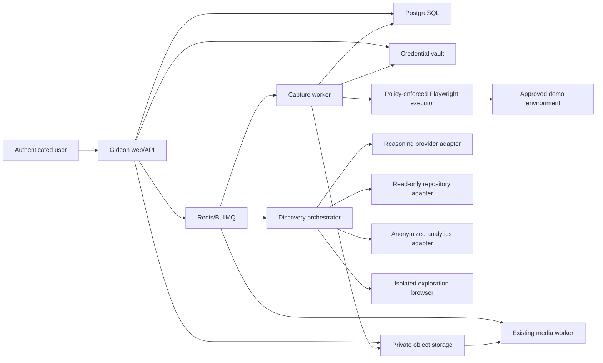

# Gideon structured product-flow capture plan

**Status:** Proposed post-MVP implementation plan

**Target release:** v2, after the upload-to-export loop is reliable

**Last updated:** 2026-07-14

## 1. Purpose

This plan defines how Gideon can discover, verify, and record the meaningful workflows in a customer's web product without requiring the customer to manually screen record each workflow.

The intended product promise is:

> Connect a safe demo environment. Gideon maps the product, proposes the journeys worth showing, and records clean, verified demonstrations after approval.

The system must not promise exhaustive coverage of every theoretical application state. Instead, it must provide measurable coverage of the environments, personas, goals, and branches that the customer placed in scope, and clearly report unknown, blocked, and unverified areas.

This work is deliberately post-MVP. It must not delay or destabilize Gideon's existing `upload -> analyze -> approve -> render -> export` loop.

## 2. Goals

1. Let a user connect a staging, preview, demo, or disposable product environment.
2. Discover meaningful product workflows from approved inputs:
   - the running UI;
   - optional read-only repository context;
   - existing browser tests;
   - optional anonymized product analytics;
   - explicit user goals and personas.
3. Present proposed workflows for human review before recording.
4. Execute approved workflows in isolated browser workers with deterministic Playwright automation.
5. Use AI computer control only for bounded exploration, interpretation, and recovery.
6. Produce clean recording artifacts plus structured interaction evidence and verification receipts.
7. Feed captured recordings into the current Gideon analysis pipeline without weakening artifact lineage or privacy.
8. Report coverage by explicit dimensions rather than claiming unsupported completeness.
9. Keep model, browser, repository, analytics, and credential vendors behind interfaces.
10. Prevent autonomous capture from performing unapproved financial, destructive, security-sensitive, publishing, or real-customer actions.

## 3. Non-goals

- Native desktop application capture in the first release.
- Mobile-native application capture.
- Guaranteed discovery of every reachable state.
- Autonomous operation against arbitrary production accounts.
- Defeating CAPTCHA, bot protection, MFA, or access controls.
- Using real customer data to make a demo look populated.
- Autonomous purchases, billing changes, deletion, publishing, invitations, permission changes, or credential changes.
- Recording raw exploratory agent sessions as polished marketing footage.
- Replacing Playwright with a screenshot-only computer-use agent.
- Automatically publishing captured content.
- Treating repository access as permission to run arbitrary repository code.

## 4. Product principles

### 4.1 Coverage must be bounded and honest

Coverage is always relative to a declared scope:

- environment version or deployment;
- allowed domains;
- personas and roles;
- supplied test accounts;
- feature flags;
- user goals;
- approved action classes;
- discovery and execution budgets.

Gideon must show the denominator behind every coverage statement. It should say “8 of 10 approved workflows verified” rather than “80% of the product covered” when the total product state space is unknown.

### 4.2 Exploration and recording are separate stages

Exploration can be adaptive, slow, and imperfect. Final recording must be reproducible, smooth, and verified. An agent discovers or repairs a workflow; Playwright performs the clean take from a known starting state.

### 4.3 Humans approve intent, not every mouse movement

The user approves the proposed workflow, persona, starting data, expected outcome, and permitted side-effect class. Gideon can then compile the workflow into low-level actions. Any material change to intent or risk requires new approval.

### 4.4 Credentials are capabilities, not prompt text

Credentials must be stored in an encrypted secret service and referenced by opaque grant IDs. Raw passwords, session cookies, API keys, and MFA seeds must not appear in model prompts, job payloads, logs, traces, screenshots, or generated artifacts.

### 4.5 Every result needs a verification receipt

A successful click sequence is not enough. Each captured workflow must prove its expected outcome using bounded assertions such as URL, accessible role/name, visible status, DOM state, or an approved application-specific check.

### 4.6 Generated capture remains source evidence

AI may plan navigation, but it cannot invent product states or marketing claims. Captured frames and verified workflow outcomes become the same kind of untrusted, reviewable product evidence as an uploaded recording.

## 5. Product modes

### 5.1 Guided URL capture

Required inputs:

- environment URL;
- allowed domains;
- disposable test account or user-performed session bootstrap;
- primary product outcome;
- selected personas;
- prohibited actions.

Gideon explores the rendered application, proposes workflows, and records approved flows. This mode can discover visible happy paths but cannot reliably identify hidden routes, disabled features, or roles for which no account is supplied.

### 5.2 Repository-informed capture

Adds a read-only repository snapshot or Git provider installation. Gideon may inspect:

- route declarations;
- navigation definitions;
- accessible UI labels;
- feature flag names and safe defaults;
- seed and fixture descriptions;
- existing Playwright/Cypress tests;
- API schemas and typed client calls;
- product documentation stored in the repository.

Repository contents remain untrusted. The discovery worker does not execute arbitrary project scripts. Any preview environment build is a separate, explicitly configured build service with its own isolation and policy.

### 5.3 Usage-informed capture

Adds an optional analytics adapter. Only coarse, anonymized event sequences and counts are imported. Gideon uses them to rank representative journeys and distinguish frequently used workflows from merely reachable UI.

Raw user identifiers, free-form event properties, page content, recordings, and session-replay payloads are out of scope. Analytics are a prioritization signal, not authorization to reproduce real customer data.

### 5.4 Existing-test import

Imports supported Playwright or Cypress scenarios into Gideon's versioned flow schema. Imported tests still pass through action-policy validation and user approval before capture. This should be the fastest and most reliable path for mature products.

## 6. Target user experience

### 6.1 Entry point

The recording step offers two choices:

1. `Upload a recording` — the existing MVP path.
2. `Let Gideon capture my product` — the v2 path.

The second option explains that it requires a safe demo environment and that no recording begins until flows are reviewed.

### 6.2 Connect environment

The user provides:

- environment name and base URL;
- environment type: local preview, staging, demo, or production-like sandbox;
- allowed first-party and required third-party domains;
- viewport preset;
- primary product outcome;
- personas/roles to cover;
- disposable credential grants;
- reset method, fixture, or starting-state instructions;
- actions that must always be blocked.

Gideon validates DNS, TLS, redirects, robots/bot restrictions where relevant, login reachability, and whether all network destinations remain in policy. A failed validation creates no discovery job.

### 6.3 Discovery review

The UI shows proposed workflows grouped by persona and outcome. Each workflow includes:

- name and purpose;
- starting state;
- ordered human-readable steps;
- expected result;
- estimated capture duration;
- source signals: UI exploration, repository, test, analytics, or user input;
- confidence and known assumptions;
- required side-effect class;
- blockers or missing prerequisites;
- marketing proof potential;
- duplicate/overlap explanation.

Users can approve, edit, merge, reject, reprioritize, or manually add a workflow. Editing creates a new revision and invalidates compiled executions for the previous revision.

### 6.4 Capture run

The user selects approved workflows and chooses `Capture approved flows`. The run shows measurable stages:

1. Preparing disposable environment.
2. Establishing approved session.
3. Resetting test data.
4. Compiling workflow.
5. Verifying dry run.
6. Recording clean take.
7. Validating media and expected outcome.
8. Preparing coverage report.

The user can leave the page. Cancellation is cooperative and must terminate the browser container, revoke temporary credentials, and preserve already committed safe artifacts.

### 6.5 Results

For each workflow, the user sees:

- video preview;
- verified or failed outcome;
- source environment/deployment fingerprint;
- persona and flow revision;
- recorded duration;
- warnings such as animation instability or masked content;
- retry, repair, exclude, and approve actions.

The coverage report separately shows:

- approved workflows captured;
- candidate workflows not approved;
- known routes or goals not represented;
- roles and feature flags covered;
- blocked external or sensitive actions;
- flows requiring user intervention;
- unknown areas where Gideon lacks a trustworthy denominator.

The user then selects clips to assemble as the project's active source recording. Existing moment review, concept generation, script approval, rendering, and export continue unchanged.

## 7. System architecture



### 7.1 Main components

#### Capture environment service

Owns environment configuration, domain policy, personas, reset strategy, credential grants, validation, and deployment fingerprints.

#### Discovery orchestrator

Combines deterministic crawling, optional repository/test/analytics signals, and provider-neutral AI reasoning. It produces structured candidate flows and coverage observations, never executable shell code.

#### Browser policy gateway

Mediates every navigation and interaction. It enforces domain, action, network, download, popup, clipboard, and data-entry policy before Playwright or computer use acts.

#### Exploration browser

Runs adaptive UI exploration in an ephemeral container. It can accept action proposals from an OpenAI or Anthropic computer-use adapter, but the gateway decides whether to execute each action.

#### Flow compiler

Converts an approved flow revision into a deterministic Playwright execution plan using stable locator strategies, assertions, fixture references, secret references, and bounded fallback rules.

#### Capture worker

Resets state, performs a dry run, records a clean take, captures action telemetry, validates the result, normalizes the media, and commits artifacts atomically.

#### Coverage service

Builds explicit coverage snapshots from known routes, states, roles, goals, flows, analytics sequences, executions, and blockers. It never turns unknown areas into assumed success.

### 7.2 Provider boundaries

Introduce narrow interfaces:

```ts
interface FlowReasoningProvider {
  proposeFlows(input: DiscoveryEvidenceBundle): Promise<FlowProposal[]>;
  refineFlow(input: FlowRefinementInput): Promise<FlowProposal>;
  proposeRecovery(input: RecoveryEvidenceBundle): Promise<RecoveryProposal>;
}

interface ComputerControlProvider {
  proposeNextAction(input: BrowserObservation): Promise<ProposedBrowserAction>;
}

interface BrowserExecutor {
  execute(plan: CompiledFlowPlan, policy: ExecutionPolicy): Promise<ExecutionReceipt>;
}

interface RepositoryDiscoveryAdapter {
  createBoundedSnapshot(connectionId: string, revision: string): Promise<RepositoryEvidenceManifest>;
}

interface UsageSequenceAdapter {
  listAnonymizedSequences(scope: AnalyticsScope): Promise<UsageSequenceSummary[]>;
}
```

Codex/Claude Code may be used during an internal concierge phase or through Gideon's existing MCP control plane. Production customer capture should use server-side provider adapters or customer-supplied approved agents; it must not depend on a desktop coding-agent session staying open.

## 8. Flow discovery design

### 8.1 Evidence bundle

Every discovery run receives an immutable, bounded bundle containing:

- environment version and validation receipt;
- goals and persona definitions;
- allowed action policy;
- discovered pages and UI state fingerprints;
- accessible element summaries;
- redacted screenshots where required;
- optional repository evidence manifest;
- optional imported test manifests;
- optional anonymized usage sequences;
- prior approved/rejected flow revisions;
- discovery limits and prompt version.

Visible page text, repository text, test names, analytics labels, and application output are untrusted evidence and cannot override system or policy instructions.

### 8.2 Deterministic inventory

Before model-guided exploration, the browser crawler should:

1. Start from approved entry points.
2. Record URL templates after removing opaque IDs and sensitive query values.
3. Inventory accessible links, buttons, tabs, forms, dialogs, and navigation landmarks.
4. Detect obvious state transitions using DOM mutations, URL changes, network completion, and stable visible outcomes.
5. Avoid submitting forms until their action class is known.
6. Fingerprint states using a combination of:
   - normalized URL template;
   - accessible-tree hash;
   - bounded DOM structure hash;
   - screenshot perceptual hash;
   - persona and fixture state;
   - relevant feature flags.
7. Merge near-duplicate states while retaining provenance and confidence.

### 8.3 Agent-guided exploration

The reasoning provider receives goals such as “reach the first successful export” rather than “click everything.” It may propose only typed browser actions:

- navigate to an allowed URL;
- click an identified locator;
- type a literal safe value;
- type a value referenced by a fixture or secret handle;
- select an option;
- press an allowed key;
- wait for a bounded condition;
- assert an observable outcome;
- request user intervention;
- stop with a blocker.

Raw JavaScript evaluation, arbitrary shell commands, arbitrary downloads, unrestricted clipboard access, and free-form network calls are not available to the model.

### 8.4 Repository-informed discovery

Repository ingestion should prefer structural extraction over sending broad source trees to a model. Extractors produce bounded facts such as:

- route path and required role;
- navigation label and destination;
- page/component name;
- form/button accessible names;
- test title and step summaries;
- feature flag identifier without secret values;
- fixture and seed capability descriptions;
- declared application events.

Snapshots exclude `.env*`, secret files, credentials, build outputs, binaries, dependency folders, source maps, and files exceeding configured limits. Repository authorization is read-only and revocable.

### 8.5 Analytics-informed ranking

Analytics integration imports aggregates such as:

```ts
type UsageSequenceSummary = {
  schemaVersion: "1";
  personaKey?: string;
  eventKeys: string[];
  approximateSessions: number;
  completionRate?: number;
  medianElapsedMs?: number;
};
```

Event properties are dropped unless individually allowlisted and proven non-sensitive. Low-volume sequences should be suppressed to reduce re-identification risk.

### 8.6 Candidate flow ranking

Store separate ranking factors rather than only an opaque total:

- explicit user priority;
- proximity to the primary product outcome;
- observed usage frequency;
- repository/test support;
- marketing proof potential;
- visual distinctiveness;
- persona importance;
- successful verification history;
- overlap with already approved flows;
- estimated execution cost and risk.

Users can see why a flow was recommended and override its rank.

## 9. Versioned flow contract

An approved flow is declarative and cannot contain generated code:

```ts
type ProductFlowRevision = {
  schemaVersion: "1";
  id: string;
  revision: number;
  projectId: string;
  environmentVersionId: string;
  personaId: string;
  title: string;
  goal: string;
  startingState: {
    entryPath: string;
    fixtureProfileId?: string;
    credentialGrantId?: string;
  };
  steps: Array<{
    id: string;
    intent: string;
    action:
      | { type: "navigate"; path: string }
      | { type: "click"; target: LocatorSpec }
      | { type: "fill"; target: LocatorSpec; valueRef: string }
      | { type: "select"; target: LocatorSpec; optionRef: string }
      | { type: "key"; target?: LocatorSpec; key: AllowedKey }
      | { type: "wait_for"; assertion: AssertionSpec };
    expectedState?: AssertionSpec[];
    riskClass: BrowserActionRisk;
  }>;
  finalAssertions: AssertionSpec[];
  approval: {
    status: "draft" | "approved" | "rejected";
    approvedBy?: string;
    approvedAt?: string;
    approvedRevision?: number;
  };
  sourceEvidenceIds: string[];
};
```

Locator priority is accessibility role/name, test ID, stable label association, and stable application-owned attributes. CSS selectors and coordinates are last-resort compiled details and should not be persisted as the human-reviewed source of truth.

## 10. Clean capture execution

### 10.1 Preflight

For each approved flow:

1. Allocate an ephemeral browser container with CPU, memory, time, and network limits.
2. Resolve the current environment version and compare it with the approved version.
3. Obtain a short-lived credential capability scoped to the environment and persona.
4. Apply the reset strategy or restore a known snapshot.
5. Establish authentication through a deterministic login adapter or user-created session bootstrap.
6. Compile the approved flow revision.
7. Run a non-recorded verification pass.
8. If the dry run fails, attempt bounded repair or stop for review.

### 10.2 Recording pass

The final pass should:

- use a fixed browser/version, viewport, locale, timezone, color scheme, and reduced-motion policy;
- disable password managers, notifications, extensions, autofill overlays, and browser chrome where possible;
- use deterministic fixture data;
- wait on observable application conditions rather than arbitrary sleeps;
- record browser video and separate structured action telemetry;
- render a clean cursor overlay from telemetry when native capture is unreliable;
- pause briefly at user-visible proof states according to capture style policy;
- mask credential fields and configured sensitive locators in screenshots and video;
- block unexpected popup, download, permission, and external-navigation behavior;
- stop immediately if deployment fingerprint, domain policy, or risk class changes.

### 10.3 Media normalization

Playwright/browser output is an intermediate artifact. The media worker must:

1. Validate the container and streams.
2. Normalize to Gideon's supported source profile using safe FFmpeg argument arrays.
3. Preserve raw capture, action telemetry, and normalization manifest as private artifacts.
4. Record browser, Playwright, FFmpeg, viewport, environment, flow, fixture, and policy versions.
5. Generate a poster frame and bounded QA samples.
6. Reject captures with blank frames, modal obstructions, unexpected navigation, obvious error states, or missing final assertions.

### 10.4 Multiple flows and the existing source model

Do not immediately redesign the downstream analysis system around arbitrary clip collections. A capture session should produce:

- one private normalized clip per approved flow;
- one versioned assembly manifest describing selected clips and optional transitions;
- one deterministic composite `source_recording` artifact used by the existing analysis pipeline.

The composite source recording retains lineage to every flow execution and raw capture. Reordering, excluding, or recapturing a flow creates a new assembly/source-recording version and marks downstream analysis artifacts stale using existing rules.

## 11. Coverage model

### 11.1 Coverage dimensions

Coverage snapshots should report independently:

- **Goal coverage:** declared user goals with at least one verified flow.
- **Approved-flow coverage:** approved flow revisions with successful current captures.
- **Persona coverage:** requested roles/personas with verified flows.
- **Route coverage:** known route templates visited, when a trustworthy route inventory exists.
- **State coverage:** known significant UI states observed, when the state inventory is bounded.
- **Usage-sequence coverage:** top anonymized sequences represented by a verified flow.
- **Feature-flag coverage:** declared relevant flag variants exercised.
- **Outcome coverage:** expected business outcomes with verification receipts.
- **Failure-state coverage:** explicitly requested empty, validation, permission, or recoverable error states.

### 11.2 Unknowns and blockers

Each dimension records:

- known denominator source;
- covered IDs;
- uncovered IDs;
- excluded IDs and user-provided reason;
- blocked IDs and blocker code;
- unknown count or `unknown` when no denominator exists;
- environment and evidence versions;
- calculation version.

The UI must never convert `unknown` into zero uncovered items.

### 11.3 Suggested blocker codes

- `authentication_required`
- `mfa_user_intervention_required`
- `captcha_or_bot_challenge`
- `missing_persona`
- `missing_fixture`
- `external_domain_not_allowed`
- `destructive_action_not_allowed`
- `financial_action_not_allowed`
- `publishing_action_not_allowed`
- `permission_change_not_allowed`
- `unstable_ui`
- `unexpected_environment_version`
- `assertion_not_observable`
- `prompt_injection_suspected`
- `budget_exhausted`
- `unsupported_browser_capability`

## 12. Data model additions

Add these tables in migrations only when the corresponding milestone is implemented. Every tenant-owned row includes `workspace_id` and composite tenant ownership constraints.

### 12.1 `capture_environments`

Stores environment identity, type, base URL in protected form, allowed-domain policy, status, reset adapter, and latest validated version. It never stores raw credentials.

### 12.2 `capture_environment_versions`

Immutable validation receipt containing resolved host policy, TLS result, application fingerprint, viewport/browser policy, validation time, and safe failure codes.

### 12.3 `capture_personas`

Workspace/project-scoped persona key, role description, fixture profile, credential grant reference, status, and revision.

### 12.4 `credential_grants`

Metadata and vault reference only: provider, environment scope, persona scope, permitted purpose, expiry, revocation state, creator, and last-used timestamp. No secret material is stored in PostgreSQL or serialized into jobs.

### 12.5 `discovery_runs`

Immutable inputs and provider/prompt versions, status, budgets, environment version, evidence manifest artifact, result manifest artifact, cost, and job relation.

### 12.6 `ui_states` and `ui_transitions`

Bounded projections for discovered states and transitions. Large accessible-tree, DOM, screenshot, and trace payloads live as private artifacts. Database fields contain safe fingerprints and labels.

### 12.7 `product_flows` and `product_flow_revisions`

Stable flow identity plus immutable declarative revisions, approval state, persona, goal, risk summary, evidence references, and optimistic revision values.

### 12.8 `capture_runs` and `flow_executions`

Capture batch plus per-flow attempt state, compiled plan hash, environment/flow/policy versions, browser receipt, verification result, cost, and artifact references.

### 12.9 `coverage_snapshots`

Immutable versioned coverage calculation and safe projection. Full manifests live in object storage.

### 12.10 Existing table changes

- Add capture/discovery/assembly job kinds through a migration and exhaustive TypeScript handling.
- Add artifact kinds for discovery evidence, exploration trace, flow plan, raw browser capture, action telemetry, verification receipt, normalized flow clip, capture assembly manifest, and coverage report.
- Add an `origin` or typed provenance relation to `source_recordings` so `uploaded` and `captured_assembly` recordings share downstream behavior without losing their origin.
- Keep generic jobs, usage events, audit logs, and outbox events as the durability and observability backbone.

## 13. Job and state-machine design

### 13.1 Job kinds

- `environment_validation`
- `flow_discovery`
- `flow_compile`
- `flow_dry_run`
- `flow_capture`
- `capture_normalize`
- `capture_assembly`
- `coverage_calculation`

### 13.2 Discovery run states

```text
draft -> queued -> inventory -> exploring -> synthesizing -> validating
      -> ready_for_review
      -> failed | canceled
```

### 13.3 Flow revision states

```text
draft -> approved -> compiled -> verified -> captured
   |        |           |          |
rejected  stale       failed     stale
```

Environment, persona, fixture, policy, or flow changes mark compiled and captured descendants stale. Prior artifacts remain immutable and reviewable.

### 13.4 Capture execution states

```text
queued -> provisioning -> resetting -> authenticating -> dry_running
       -> repairing -> recording -> normalizing -> verifying -> completed
       -> needs_review | failed | canceled
```

### 13.5 Idempotency

Idempotency inputs include:

- workspace and project;
- environment version;
- persona and fixture revision;
- flow revision;
- compiled plan hash;
- credential grant identity but never secret value;
- browser/viewport policy;
- capture style version;
- reset strategy version.

Retries may reuse immutable discovery evidence and successful dry-run receipts when policy permits. A clean recording is reusable only within the same workspace and exact manifest hash.

## 14. Proposed API surface

All mutating endpoints require authentication, workspace authorization, CSRF protection for cookie sessions, runtime schema validation, rate limits, and idempotency keys for expensive operations. Long operations return `202 Accepted` with the standard job envelope.

### 14.1 Environments and personas

- `POST /api/v1/projects/{projectId}/capture-environments`
- `GET /api/v1/projects/{projectId}/capture-environments`
- `GET /api/v1/projects/{projectId}/capture-environments/{environmentId}`
- `PATCH /api/v1/projects/{projectId}/capture-environments/{environmentId}`
- `POST /api/v1/projects/{projectId}/capture-environments/{environmentId}/validate`
- `POST /api/v1/projects/{projectId}/capture-personas`
- `PATCH /api/v1/projects/{projectId}/capture-personas/{personaId}`

Credential creation should use a dedicated server-to-vault exchange or user-performed browser bootstrap. General environment responses expose only grant status, scope, and expiry.

### 14.2 Discovery and flows

- `POST /api/v1/projects/{projectId}/discovery-runs`
- `GET /api/v1/projects/{projectId}/discovery-runs/{runId}`
- `POST /api/v1/projects/{projectId}/discovery-runs/{runId}/cancel`
- `GET /api/v1/projects/{projectId}/product-flows`
- `GET /api/v1/projects/{projectId}/product-flows/{flowId}`
- `PATCH /api/v1/projects/{projectId}/product-flows/{flowId}` creates a revision.
- `POST /api/v1/projects/{projectId}/product-flows/{flowId}/approve`
- `POST /api/v1/projects/{projectId}/product-flows/{flowId}/reject`

### 14.3 Capture and coverage

- `POST /api/v1/projects/{projectId}/capture-runs`
- `GET /api/v1/projects/{projectId}/capture-runs/{captureRunId}`
- `POST /api/v1/projects/{projectId}/capture-runs/{captureRunId}/cancel`
- `POST /api/v1/projects/{projectId}/flow-executions/{executionId}/retry`
- `POST /api/v1/projects/{projectId}/capture-assemblies`
- `GET /api/v1/projects/{projectId}/coverage-snapshots/latest`

Preview URLs remain short-lived and are minted only after project/workspace authorization. No endpoint returns vault references usable outside Gideon, object keys, raw traces, prompt payloads, cookies, or private paths.

## 15. Security and privacy design

### 15.1 Environment isolation

- One ephemeral container or microVM per active capture session.
- No shared browser profile, cookie jar, filesystem, clipboard, or cache across workspaces.
- Read-only base image and disposable writable layer.
- No access to Gideon production networks, metadata services, internal DNS, control plane, database, Redis, or storage credentials.
- Separate egress proxy enforcing resolved-IP and hostname policy on every request and redirect.
- DNS rebinding defenses and blocking for loopback, link-local, private, multicast, and cloud metadata ranges unless an explicitly managed local-preview connector is used.
- CPU, memory, process, storage, network, screenshot, step, and wall-clock limits.

### 15.2 Action policy

Classify every proposed action:

1. `observe` — screenshots, DOM/accessibility inspection.
2. `navigate` — allowed-domain navigation.
3. `synthetic_write` — create or edit disposable test data.
4. `external_side_effect` — email, webhook, integration, download, or third-party submission.
5. `financial` — checkout, subscription, payout, or billing mutation.
6. `destructive` — delete, revoke, purge, or irreversible mutation.
7. `security_sensitive` — credentials, MFA, roles, permissions, tokens, or identity.
8. `publish_or_invite` — public content, outbound invites, or external sharing.

Default capture allows only observe, navigate, and approved synthetic writes in non-production environments. The remaining classes require explicit policy and, initially, should remain technically blocked rather than merely prompt-blocked.

### 15.3 Credential handling

- Prefer application-provided test-session bootstrap tokens that are single-use, short-lived, environment-bound, and role-bound.
- Otherwise use a vault-backed login adapter whose executor resolves secret references at action time.
- Never send raw credentials to the reasoning provider.
- Mask password, token, payment, personal-data, and configured sensitive locators before screenshots leave the container.
- Revoke temporary credentials and delete the browser layer at terminal job states.
- MFA pauses for user takeover; Gideon does not store reusable MFA seeds in the first release.

### 15.4 Prompt injection

- Treat page text, images, accessibility labels, repository content, test names, and downloaded content as hostile instructions.
- The model proposes actions; the policy gateway independently validates them.
- Never expose vault data, control-plane tokens, filesystem secrets, or broad network access to the model.
- Flag sudden instructions to leave the domain, reveal data, modify permissions, download executables, or ignore policy.
- Add prompt-injection fixtures that try to cause secret exfiltration and unsafe side effects.

### 15.5 Repository safety

- Use read-only, narrowly scoped provider permissions.
- Allow explicit repository and revision selection.
- Do not fetch submodules, LFS objects, release artifacts, or package dependencies by default.
- Do not execute repository code in discovery workers.
- Redact or exclude secret-shaped files before artifact creation.
- Delete snapshots according to documented retention and immediately on connection revocation where policy requires.

### 15.6 Audit requirements

Audit:

- environment connection and validation;
- credential grant creation, use, expiry, and revocation without secret values;
- repository/analytics connection and scope changes;
- discovery start/cancel/complete;
- flow approval and revision;
- action-policy exception approval;
- capture start/cancel/retry/complete;
- capture assembly activation and deletion.

## 16. Reliability and recovery

### 16.1 Reset strategies

Support reset adapters in this order:

1. Customer-provided idempotent reset endpoint with scoped authentication.
2. Customer-provided fixture API or seed profile.
3. Disposable account creation through an approved test harness.
4. Browser-based cleanup for known synthetic entities.
5. Manual reset with an explicit `needs_review` state.

Reset operations are versioned and policy-checked. A flow cannot be called deterministic without a reliable starting-state receipt.

### 16.2 Bounded repair

When a dry run fails, the repair loop can inspect the current screenshot, accessible tree, safe console summary, and the difference from expected state. It may propose locator or wait-condition changes that preserve the approved human intent.

Repair must stop when:

- the goal or side-effect class changes;
- a new domain is required;
- the expected business outcome changes;
- the environment version differs materially;
- attempts, time, or cost exceed policy;
- prompt injection is suspected;
- user intervention is required.

Material repairs create a new draft flow revision for approval. Locator-only compiled-plan repairs can remain implementation details if assertions and intent are unchanged, but are still recorded in the execution receipt.

### 16.3 Failure preservation

Preserve safe, bounded diagnostics:

- final redacted screenshot;
- safe locator/assertion failure;
- environment and flow versions;
- step ID and blocker code;
- browser console error counts and allowlisted summaries;
- network status-class summary without headers, bodies, tokens, or sensitive URLs;
- internal trace artifact with restricted retention.

User-facing messages do not expose credentials, raw page content, provider internals, traces, private paths, or stack output.

## 17. Testing strategy

### 17.1 Synthetic test applications

Build small fixture web apps specifically for capture testing:

- basic SaaS CRUD happy path;
- onboarding with empty and populated states;
- admin/member role differences;
- feature-flag variants;
- SPA navigation and server-rendered navigation;
- modals, menus, virtualized lists, file download, and multi-step forms;
- delayed network responses and recoverable errors;
- unstable selectors with stable accessible labels;
- malicious page text and images attempting prompt injection;
- external links, popups, and side-effect traps;
- fake billing and deletion actions that must be blocked.

No real customer product or credential becomes a committed fixture.

### 17.2 Unit tests

- Flow schema validation and revision rules.
- Locator compilation priority.
- Action risk classification.
- Domain/IP/redirect policy.
- State fingerprinting and duplicate merging.
- Coverage denominator and unknown handling.
- Ranking factor calculation.
- Idempotency hashes.
- Artifact lineage and stale propagation.
- Credential reference redaction.
- Provider output validation.

### 17.3 Integration tests

- Vault capability issuance, use, expiry, and revocation.
- Repository snapshot exclusion policy.
- Analytics aggregation and low-volume suppression.
- Queue retry, cancellation, heartbeat, and stale lease recovery.
- Browser container teardown at every terminal state.
- Egress denial for internal IPs, metadata services, and non-allowlisted domains.
- Capture normalization and media validation.
- Source assembly reproducibility.
- Cross-workspace access denial for every new resource.
- Deletion and retention across source and derived artifacts.

### 17.4 End-to-end tests

1. Connect a synthetic staging environment.
2. Validate it and create personas.
3. Run deterministic inventory and agent discovery.
4. Review and approve flows.
5. Dry-run and capture them.
6. Verify coverage results and blockers.
7. Assemble captured clips into the active source recording.
8. Run existing analysis through export.
9. Change the environment/flow and verify stale propagation.
10. Delete the project and verify credential revocation and artifact cleanup.

### 17.5 Security tests

- SSRF, redirect, DNS rebinding, and metadata endpoint attempts.
- Cross-tenant environment, flow, capture, trace, and preview access.
- Prompt injection requesting secrets or unsafe actions.
- Credential values in logs, prompts, screenshots, traces, job JSON, database JSON, and error envelopes.
- Unauthorized action-class escalation.
- Browser escape and container-to-control-plane access attempts.
- Malicious repository files and oversized snapshots.
- Analytics payloads containing PII or free-form sensitive properties.
- Cancellation during authentication, recording, normalization, and commit.

### 17.6 Quality evaluation

Maintain an evaluation set with expected:

- important flow recall;
- duplicate flow rate;
- successful dry-run rate;
- clean-capture success rate;
- assertion correctness;
- false-completion rate;
- repair success without intent drift;
- coverage-report accuracy;
- user acceptance/rejection reasons;
- recording smoothness and visual obstruction rate.

False completion and unsafe side effects are release blockers even when average task success is high.

## 18. Observability, quotas, and cost controls

Record safe metrics:

- discovery queue depth and age;
- browser provisioning latency;
- steps and screenshots per discovery run;
- flows proposed, approved, rejected, merged, and blocked;
- dry-run and capture success by environment class;
- repair attempts and terminal reasons;
- browser minutes, model tokens, media minutes, storage bytes, and normalized cost;
- assertion failures by safe category;
- container cleanup failures;
- credential revocation failures;
- coverage dimensions with IDs removed from aggregate metrics.

Apply workspace quotas to:

- connected environments;
- repository snapshot size;
- discovery browser minutes;
- model/tool iterations;
- screenshots and trace storage;
- approved flows per capture run;
- concurrent browser containers;
- retries per flow/environment version;
- raw capture retention.

Reserve usage before discovery and capture, then settle actual consumption idempotently. Hard-stop loops before budgets can create runaway provider or browser cost.

## 19. Delivery sequence

### Milestone 0: decision and safety spike

**Purpose:** Prove the architecture on synthetic applications before adding customer-facing contracts.

Deliverables:

- provider comparison using one OpenAI and one Anthropic computer-control adapter;
- Playwright clean-recording prototype;
- typed flow and assertion schemas;
- action policy gateway prototype;
- container and egress-isolation proof;
- credential-handle proof with no raw secret in model context;
- raw capture to normalized source-recording proof;
- risk register and cost/latency benchmark.

Exit criteria:

- The same approved flow can be replayed and verified repeatedly from a reset fixture.
- A malicious fixture cannot cause navigation or data transfer outside policy.
- The final recording is produced by deterministic replay, not agent exploration.
- Provider choice remains swappable behind the proposed interfaces.

### Milestone 1: internal concierge capture

**Purpose:** Validate customer value without exposing autonomous capture as self-service.

Deliverables:

- internal CLI/MCP workflow for repository inspection and candidate-flow generation;
- human-reviewed Playwright flow files compiled from the typed schema;
- internal capture runner and artifact manifest;
- manual upload/activation of the normalized composite recording;
- operator checklist for environment, credentials, data, and prohibited actions.

Exit criteria:

- Several consenting design partners receive useful captures.
- The team records approval/rejection reasons and measures which discovery inputs mattered.
- No real production/customer data is required.
- The workflow demonstrates a material reduction in manual recording effort.

### Milestone 2: deterministic self-service capture

**Purpose:** Ship recording from user-authored flows before autonomous discovery.

Deliverables:

- environment/persona/credential-grant models and APIs;
- validation and policy UI;
- user-authored flow editor with Playwright compilation;
- isolated dry run, capture, normalization, verification, and assembly jobs;
- capture review UI and downstream source-recording activation;
- complete workspace-isolation, deletion, quota, and audit coverage.

Exit criteria:

- A user can define, approve, record, review, and activate a flow without operator access.
- All captures have current final assertions and immutable lineage.
- Cancellation and cleanup work at every stage.
- Existing upload-based projects behave unchanged.

### Milestone 3: deterministic discovery

**Purpose:** Reduce manual flow authoring without adding a computer-use model yet.

Deliverables:

- accessible-tree/DOM inventory crawler;
- route and state fingerprinting;
- imported Playwright/Cypress test adapter;
- duplicate merging;
- candidate-flow suggestions based on navigation and explicit user goals;
- initial multi-dimensional coverage report.

Exit criteria:

- Users can review and approve useful candidate flows.
- Known denominators and unknowns are reported correctly.
- Discovery never submits an unclassified form or leaves allowed domains.

### Milestone 4: AI-guided exploration and repair

**Purpose:** Discover goal-oriented paths and recover from ordinary UI changes.

Deliverables:

- provider-neutral reasoning and computer-control adapters;
- bounded observation/action loop;
- prompt-injection detection and policy enforcement;
- flow synthesis with evidence references;
- locator/wait-condition repair loop;
- evaluation harness and provider canaries;
- approval UX for material repairs.

Exit criteria:

- AI improves important-flow recall over deterministic discovery on the evaluation set.
- False-completion and intent-drift rates meet a human-approved release threshold.
- No safety test permits an unauthorized side effect or secret exposure.
- Provider failure degrades to manual/deterministic flows rather than blocking access to prior captures.

### Milestone 5: repository-informed discovery

**Purpose:** Improve coverage of hidden, role-gated, and fixture-dependent workflows.

Deliverables:

- read-only Git provider connection;
- bounded structural extractors;
- repository evidence manifests;
- route/test/feature-flag correlation;
- connection revocation and snapshot deletion;
- repository privacy controls and audit events.

Exit criteria:

- Repository evidence materially improves candidate relevance or blocker diagnosis.
- Secret exclusion and non-execution guarantees pass security review.
- Users can see which recommendations used repository evidence.

### Milestone 6: usage-informed prioritization

**Purpose:** Make “natural workflows” reflect aggregate real behavior.

Deliverables:

- first analytics adapter;
- allowlisted event mapping and privacy review;
- aggregate sequence import;
- low-volume suppression;
- usage-aware ranking and usage-sequence coverage;
- user-visible analytics provenance and disconnect controls.

Exit criteria:

- Imported data contains no raw identities, free-form content, or replay data.
- Usage signals improve approved-flow ranking for design partners.
- Disconnect/revocation stops new imports and follows retention policy.

### Milestone 7: scale and general availability

**Purpose:** Operate browser capture reliably for multiple workspaces.

Deliverables:

- dedicated browser-worker pool and scheduler;
- per-workspace fairness and concurrency;
- capacity, cost, and failure dashboards;
- region and retention controls;
- support-safe diagnostic views;
- abuse monitoring and incident runbooks;
- published limitations and environment compatibility matrix;
- billing/entitlement model based on browser and media minutes.

Exit criteria:

- Capacity and cost remain within approved limits under load tests.
- Cleanup, credential revocation, and isolation have production alerts.
- Security/privacy review and external penetration testing are complete.
- Product copy accurately describes scoped coverage and limitations.

## 20. Rollout gates

### Internal only

- Synthetic apps and company-owned demo environments.
- No stored customer credentials.
- Manual review of every action plan.

### Design partner

- Contracted, consenting users.
- Staging/demo environments only.
- Disposable accounts and synthetic data.
- Restricted domain and action policy.
- Short raw-trace retention.
- Operator-visible kill switch.

### Limited beta

- Self-service deterministic capture.
- AI discovery opt-in.
- Repository and analytics connections separately opt-in.
- Explicit per-environment disclosure and audit history.
- Support playbooks and provider fallbacks.

### General availability

- Only after security, privacy, reliability, capacity, cost, deletion, and isolation gates pass.
- Production URLs remain disabled or require a separately reviewed restricted mode.

## 21. Product success metrics

Measure whether this feature reduces work and improves useful evidence:

- percentage of connected projects reaching at least one approved capture;
- median user time from environment connection to approved flows;
- proposed-flow approval, edit, merge, and rejection rates;
- percentage of approved flows captured without user intervention;
- clean-capture success after dry-run success;
- percentage of captures accepted into the source assembly;
- manual recording time avoided, reported by users;
- concepts/renders created from captured sources versus uploaded sources;
- false-completion and unsafe-action incidents;
- credential, tenant-isolation, or data-exposure incidents, with a target of zero;
- provider and browser cost per accepted source minute.

Do not optimize route count or click count as primary success metrics. The objective is useful, verified marketing evidence, not maximal crawling.

## 22. Documentation changes required during implementation

When a milestone becomes active, update in the same change:

- `docs/prd.md` for user-visible scope, limits, and roadmap status;
- `docs/ux-flows.md` for connection, discovery, approval, capture, blocker, and coverage states;
- `docs/technical-spec.md` for browser-worker and provider boundaries;
- `docs/database-schema.md` plus migrations for new records and lineage;
- `docs/api-contract.md` for exact request/response schemas and error codes;
- `docs/security-rules.md` for external navigation, credentials, repositories, analytics, prompt injection, isolation, and incident response;
- `docs/testing-strategy.md` for fixture apps, browser security, coverage correctness, and media capture;
- `docs/implementation-plan.md` when v2 work is scheduled;
- `AGENTS.md` when repository commands or required checks change.

## 23. Decisions required before Milestone 0 exits

1. Which environment types are permitted for the first design partners?
2. Will Gideon initially support only Chromium, or also Firefox/WebKit?
3. What is the preferred credential pattern: user session takeover, test-session bootstrap, or vault-backed login adapter?
4. What reset contract will Gideon recommend to customers?
5. Which side-effect classes remain technically impossible in the first release?
6. What raw screenshot, trace, repository snapshot, and capture retention periods apply?
7. Which provider receives screenshots and extracted repository evidence, in which regions, and under which retention settings?
8. Is repository-informed discovery included in the base plan or a higher-trust entitlement?
9. Which analytics provider is first, and what minimum aggregation threshold is required?
10. What human-reviewed thresholds gate AI discovery and repair rollout?
11. What browser-minute and model-iteration limits keep the feature economically viable?
12. Does the product expose separate capture clips indefinitely, or retain only the active assembly after a configured period?

## 24. Recommended immediate next step

Start Milestone 0 as a bounded technical and safety spike using two synthetic SaaS applications. Implement the provider-neutral flow schema, policy gateway, isolated Playwright recording pass, credential handles, verification receipt, and source-recording normalization before building any customer-facing UI. This tests the highest-risk assumptions while keeping the current MVP unchanged.
