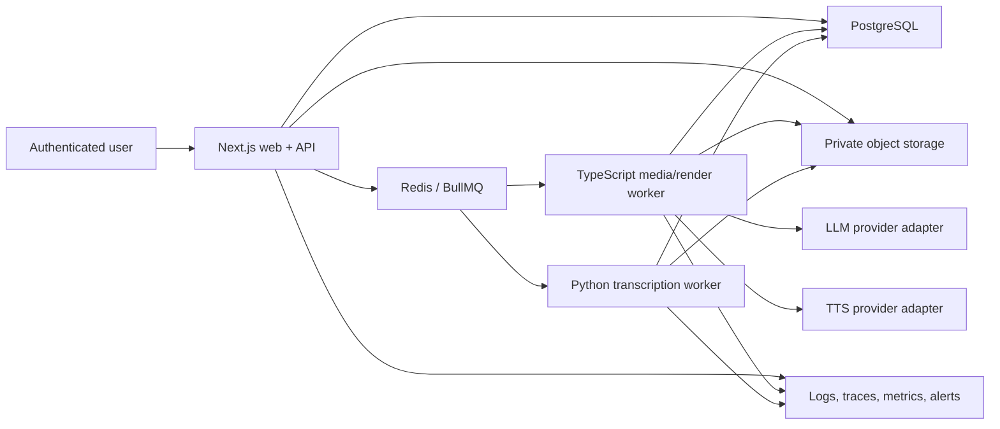
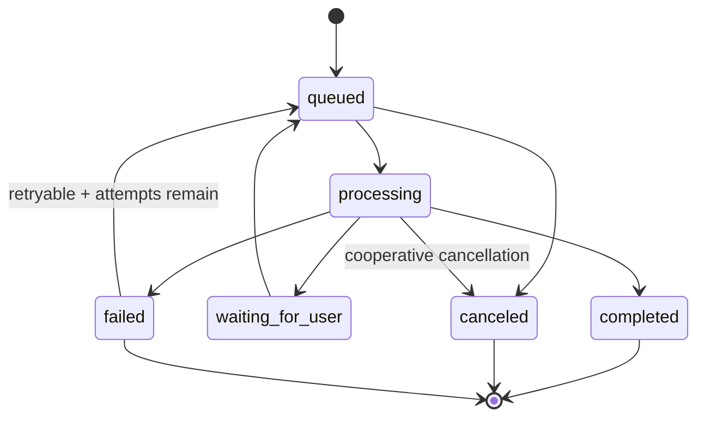

# Gideon technical specification

**Status:** Proposed MVP architecture

**Last updated:** 2026-07-06

## Goals

- Turn one private uploaded screen recording into ten evidence-backed concepts and up to three editable 9:16 MP4 drafts.
- Keep all long-running media and AI work asynchronous, resumable, idempotent, observable, and cancelable where practical.
- Separate model creativity from deterministic media execution through versioned schemas.
- Preserve human review before voice generation, rendering, and export.
- Support a small team operating the MVP without prematurely creating a microservice fleet.
- Leave clean extension points for rrweb/Playwright capture, alternative AI/TTS providers, brand kits, billing, and social scheduling.

## Non-goals

- Native/extension recording, autonomous browser control, AI avatar generation, voice cloning, social posting, analytics, or a general multitrack editor.
- Executing LLM-generated code, JSX, FFmpeg command strings, SQL, URLs, or tool calls.
- Synchronous analysis/render endpoints.
- Multi-region active-active processing in MVP.

## Architecture decision summary

| Area | MVP decision | Reason |
|---|---|---|
| Application | Next.js App Router + TypeScript monolith | One product boundary and shared types |
| API | Versioned route handlers under `/api/v1` | Explicit contract; easy extraction later |
| Data | PostgreSQL + Prisma | Relational workflow/version state and migrations |
| Queue | Redis + BullMQ | Node-native jobs, retry/progress/concurrency |
| Storage | Private S3-compatible object storage | Direct multipart uploads and signed access |
| Media | Pinned FFmpeg/ffprobe in isolated worker | Mature deterministic media primitives |
| ASR | Python faster-whisper worker | Efficient local word-timed transcription |
| AI | Provider-neutral structured-output adapters | Quality now without model lock-in |
| TTS | Paid provider adapter first | Reliable MVP quality; local later |
| Composition | Remotion + FFmpeg conformance | React templates plus mature mux/probe tools |
| Auth | Managed auth/Auth.js-compatible sessions | Avoid custom identity; own authorization |
| Deployment | Web/API + TS worker + Python worker + managed data services | Minimal operational units with safe media boundary |

## System context



Web/API, workers, and storage exchange opaque IDs and object keys. Browser clients never receive provider credentials, worker filesystem paths, Redis access, or permanent object URLs.

## Repository structure

Proposed monorepo once implementation begins:

```text
apps/
  web/                 Next.js UI and /api/v1 route handlers
  worker-media/        BullMQ media, AI, TTS, and Remotion jobs
  worker-transcribe/   Python faster-whisper worker/service
packages/
  contracts/           Zod schemas, API DTOs, events, render manifest
  db/                  Prisma schema, migrations, client, repositories
  auth/                Session and authorization helpers
  jobs/                Queue names, payloads, state machine, producers
  ai/                  Prompt registry, provider adapters, eval fixtures
  media/               FFmpeg operation builder and probe validators
  renderer/            Remotion compositions/templates and render API
  observability/       Logger, tracing, metrics, redaction
  config/              Validated environment configuration
tests/
  fixtures/            Small safe media, golden manifests, model fixtures
  contract/            Schema/backward compatibility tests
  e2e/                 Playwright user journeys
docs/                   Product and engineering source of truth
infra/                  Dockerfiles and deployment configuration
```

MVP may keep packages inside one workspace. Boundaries are enforced by imports and contracts before services are separated.

## Core domain model

### Artifact version chain

Every derived artifact identifies the immutable versions used to create it:

```text
ProductProfile v3 + SourceRecording v1
  -> AnalysisRun v2
  -> DetectedMoments reviewed v4
  -> ContentAngle v1
  -> Script v3 approved
  -> Voiceover v1
  -> RenderManifest v5 / RenderJob attempt 2
  -> GeneratedVideo v5
  -> Export v1
```

Edits create versions or revisions; they do not mutate an already-rendered artifact invisibly. Downstream artifacts compare input version IDs and become `stale` when necessary.

### Evidence bundle

The AI input is a bounded, redacted `WalkthroughEvidenceBundle`:

```ts
type WalkthroughEvidenceBundle = {
  schemaVersion: "1";
  projectId: string;
  productProfileVersion: string;
  recording: {
    durationMs: number;
    width: number;
    height: number;
    hasAudio: boolean;
  };
  evidenceCatalog: Array<{
    sourceId: `transcript:${string}` | `frame:${string}` | `moment:${string}`;
    kind: "transcript_segment" | "frame" | "fallback_moment";
    startMs?: number;
    endMs?: number;
    timestampMs?: number;
  }>;
  transcript?: Array<{
    sourceId: `transcript:${string}`;
    startMs: number;
    endMs: number;
    text: string;
    confidence?: number;
  }>;
  frames: Array<{
    sourceId: `frame:${string}`;
    frameId: string;
    timestampMs: number;
    signedModelInputRef: string;
    ocrText?: string;
    uiElements?: Array<{
      kind: "heading" | "button" | "input" | "navigation" | "status" | "table" | "copy" | "other";
      text: string;
      role?: string;
      confidence?: number;
      box?: { x: number; y: number; width: number; height: number };
    }>;
    changeScore?: number;
    interactionHints?: Array<{
      kind: "click_target" | "cursor_candidate";
      x: number;
      y: number;
      confidence: number;
      label?: string;
    }>;
  }>;
  userMoments?: Array<{
    startMs: number;
    endMs: number;
    label: string;
  }>;
};
```

The model sees only bounded media inputs or provider-uploaded ephemeral assets. Signed references are not persisted in prompts/logs. OCR/transcript text is wrapped as untrusted evidence and cannot supply instructions.
Provider semantic-analysis outputs must carry `sourceEvidenceIds` copied from the evidence catalog. The server rejects missing or unknown source IDs before accepting AI-detected moments, so generated claims stay tied to transcript segments, OCR frames, or deterministic fallback moments.

### Edit decision list

AI and user choices compile into a renderer-neutral, schema-validated `EditDecisionList` (EDL):

```ts
type EditDecisionList = {
  schemaVersion: "2";
  templateId: string;
  templateKey:
    | "hidden_feature_reveal"
    | "saves_you_time"
    | "problem_demo_payoff"
    | "founder_demo"
    | "three_reasons"
    | "before_after_workflow"
    | "brand_presenter";
  templateVersion: number;
  brandKitId: string;
  durationMs: number;
  canvas: { width: 1080; height: 1920; fps: 30 };
  brandKit: {
    id?: string;
    productName: string;
    primaryColor: string;
    accentColor: string;
    backgroundColor: string;
    captionStyle: "kinetic_bold" | "clean_founder" | "educational_stack";
    ctaStyle: "soft_try" | "direct_signup" | "learn_more";
    tagline?: string;
    logoPath?: string;
  };
  sourceSegments: Array<{
    momentId: string;
    sourceStartMs: number;
    sourceEndMs: number;
    timelineStartMs: number;
    timelineEndMs: number;
    fit: "contain" | "cover";
    focus: { x: number; y: number; scale: number };
  }>;
  zooms: Array<{
    startMs: number;
    endMs: number;
    fromScale: number;
    toScale: number;
    focus: { x: number; y: number; scale: number };
    easing: "standard" | "snap" | "spring";
  }>;
  captions: Array<{
    startMs: number;
    endMs: number;
    text: string;
    words?: Array<{ startMs: number; endMs: number; text: string }>;
  }>;
  overlays: Array<{
    kind: "hook" | "proof_label" | "callout" | "cta" | "brand_badge";
    startMs: number;
    endMs: number;
    text: string;
    position: "top" | "center" | "bottom" | "left" | "right";
    emphasis: "primary" | "secondary" | "accent";
  }>;
  callouts: Array<{
    id: string;
    startMs: number;
    endMs: number;
    text: string;
    anchor: { x: number; y: number; scale: number };
    arrow: {
      enabled: boolean;
      direction: "auto" | "left" | "right" | "up" | "down";
    };
    evidenceIds?: string[];
  }>;
  cursorCues: Array<{
    id: string;
    kind: "click_target" | "cursor_candidate";
    startMs: number;
    endMs: number;
    anchor: { x: number; y: number; scale: number };
    label?: string;
    confidence: number;
  }>;
  sfx: Array<{
    id: string;
    kind: "click" | "pop" | "whoosh";
    startMs: number;
    gainDb: number;
  }>;
  presenter: {
    enabled: boolean;
    style: "logo_head";
    startMs: number;
    endMs: number;
    position: "lower_left" | "lower_right";
    logoPath?: string;
    motion: "idle_bob" | "caption_sync";
  };
  music: {
    enabled: boolean;
    mood: "none" | "clean_tech" | "upbeat";
    gainDb: number;
  };
  qualityGates: {
    requireEvidenceBackedClaims: boolean;
    requireCaptionSafeArea: boolean;
    requireAudioAlignment: boolean;
  };
};
```

Validation enforces duration bounds, source ranges, normalized focus coordinates, safe scale limits, caption/word timing, caption/hook/CTA fit against safe areas, overlay/callout/presenter/SFX timing, audio gain bounds, and referenced-object ownership. The current desktop implementation renders this EDL through FFmpeg plus generated transparent overlay frame sequences and deterministic generated audio tones; no arbitrary filter string, component name, URL, path, or command is accepted from AI or user-controlled text.

### Render manifest

The immutable `RenderManifest` adds exact template/version, font assets, object checksums, output profile, and manifest hash. The hash is the render idempotency key. Identical final manifests can reuse a completed artifact within the same workspace and retention policy.

## Frontend architecture

### Rendering model

- Use React Server Components for initial authenticated data reads and page shells.
- Use Client Components only for upload, rich editing, player synchronization, job updates, and optimistic interaction.
- Keep database/provider/storage modules server-only and guarded from client imports.
- Use route handlers as the public API; avoid duplicating mutation logic in unrestricted server actions.
- If server actions are later used, treat each as a public endpoint with auth, authorization, validation, CSRF/origin controls, and rate limits.

### State strategy

- Server state is authoritative and fetched through typed API clients/query hooks.
- URL encodes selected project step/video/tab where useful.
- Local component state handles unsaved editing and player position.
- Autosave uses revision/ETag optimistic concurrency to prevent overwriting another session.
- Job updates use Server-Sent Events (SSE) for authenticated project event streams with polling fallback. SSE is sufficient for one-way progress and simpler than WebSockets.

### Upload architecture

1. Client requests upload session with name/type/size/optional checksum.
2. API validates workspace quota and creates `source_recording` in `initiated` state.
3. API returns short-lived multipart signed URLs scoped to generated object key and expected constraints.
4. Browser uploads directly to storage and reports part ETags/progress locally.
5. Client calls completion endpoint with parts/checksum.
6. API completes multipart upload and enqueues bounded validation.
7. Recording moves to `verified` only after worker probe/type/policy checks.

Never trust browser MIME/extension. Abort incomplete multipart uploads through lifecycle policy.

### Video preview/editor

- Use an authenticated, short-lived signed media URL after authorization.
- The MVP editor manipulates domain fields: text, caption boundaries/style preset, source in/out, normalized focus, audio mix.
- Client preview is approximate. Server render remains authoritative.
- Save uses revision precondition and returns new EDL/manifest version; current completed video becomes stale rather than being overwritten.

### Accessibility and performance

- Meet WCAG 2.2 AA for app flows.
- Virtualize long transcript/caption lists.
- Load video thumbnails/contact sheets before full-resolution preview.
- Do not hydrate static marketing sections unnecessarily.
- Set explicit cache policy: private/no-store for workspace pages and API; public immutable only for fingerprinted app assets.

## Backend/API architecture

### Route layer

Each `/api/v1` handler follows:

1. Parse request ID and authenticated session.
2. Enforce CSRF/origin for cookie-authenticated state changes.
3. Validate params/body with Zod; reject unknown write fields.
4. Authorize workspace/resource through centralized policy helper.
5. Enforce idempotency/rate/quota where applicable.
6. Execute a short transaction or enqueue work.
7. Return standard envelope with safe errors.

Handlers never run FFmpeg, ASR, LLM, TTS, or Remotion directly.

### Service and repository layers

- Domain services own transitions, versioning, quota reservation, and job creation.
- Repositories require `workspaceId` in tenant-scoped operations; no unscoped `findUnique(id)` in request paths unless followed by an equivalent enforced policy helper.
- Queue publication uses a transactional outbox so a committed domain transition cannot lose its job message.
- Workers claim outbox/job effects idempotently and write artifacts before completing job state.

### Concurrency

- Mutable resources carry integer `revision` and `updatedAt`.
- Updates accept `If-Match` or body `revision`; conflict returns `409 revision_conflict` with current representation metadata.
- Unique constraints prevent two active analysis runs of the same input version and duplicate manifest renders.
- Job effects use compare-and-set state transitions.

## Async job architecture

### Queues

| Queue | Jobs | Default concurrency |
|---|---|---:|
| `media.inspect` | probe, validate, normalize metadata | CPU bounded |
| `media.extract` | audio, frames, contact sheets, signals | Low CPU/IO bounded |
| `transcribe` | faster-whisper | Separate CPU/GPU pool |
| `ai.analysis` | summary and moments | Provider rate bounded |
| `ai.content` | concepts and scripts | Provider rate bounded |
| `tts` | voice generation | Provider rate bounded |
| `render.preview` | low-cost preview | Medium |
| `render.final` | full MP4 | Low, CPU/memory bounded |
| `cleanup` | deletion, multipart abort, expired artifacts | Scheduled |
| `outbox` | publish committed events/jobs | Frequent poll |

### Job contract

Every payload includes `schemaVersion`, `jobId`, `workspaceId`, `projectId`, input version IDs, idempotency key, trace context, and priority. It does not include secrets or permanent URLs.

### Job state machine



Progress is stage plus optional units (`bytes`, `frames`, `segments`) and bounded percent. Workers heartbeat leases. Stalled jobs are recovered only when the previous lease expires; every effect is idempotent. The shared job-state helpers and store methods model `workerId`, `heartbeatAt`, and `leaseExpiresAt`, renew leases on heartbeat, reject mismatched worker heartbeats, mark dispatch failures against the owning lease, and turn expired running leases into retryable failures for durable worker recovery. Retry events and audit entries record previous attempt, next attempt, and max attempts; executor lifecycle events carry attempt/max-attempt metadata so stage timelines remain separable after retries. Hosted worker intake can call these methods through a lease coordinator before and after verified dispatch. The hosted worker runtime adapter detaches accepted jobs into a queue runner, heartbeats during execution, reports failures through the lease coordinator, and leaves the broker implementation swappable. Hosted enqueue paths can target a broker interface; `GIDEON_HOSTED_QUEUE_PROVIDER=memory` auto-wires the in-memory broker-backed service for local composition, and `GIDEON_HOSTED_QUEUE_PROVIDER=bullmq` with `GIDEON_REDIS_URL` or `REDIS_URL` auto-wires the Redis-backed BullMQ broker for durable hosted queues. A hosted worker process composes broker subscription, store-backed leases, executor hooks, stats, stop handling, worker identity/lease settings, and structured JSON lifecycle/job metrics for a separate worker runtime. `createGideonJobExecutor` centralizes the real analysis/render execution path behind injectable store, media, provider, and storage boundaries. `src/main/jobExecutorAdapter.ts` is the single adapter layer used by desktop queue tasks and hosted worker executors; MCP-triggered jobs enter through the live control socket and then use the same desktop queue adapter instead of duplicating execution logic.

### Retry policy

- Provider rate limit/5xx/network: exponential backoff with jitter and provider `Retry-After`.
- Worker crash/lease timeout: retry from committed artifact boundary.
- Invalid media, schema, permission, policy, unsupported codec: no automatic retry.
- Render transient: up to two retries; deterministic failure with same manifest is not retried indefinitely.
- Dead-letter after terminal failure with alert and redacted diagnostic reference.

### Cancellation

API sets `cancel_requested_at`; worker checks between safe phases and terminates child process group. Partial objects use a temporary prefix and are deleted. Reservations are settled/refunded according to completed provider work.

## Video processing architecture

### Ingest and validation

1. Verify object metadata, size, generated key, and quarantine location.
2. Run current pinned `ffprobe` in isolated container with wall-clock/output limits.
3. Validate actual container/streams, duration, dimensions, frame rate, stream count, and codec policy.
4. Reject polyglot/invalid content where detected; optionally malware scan before decode.
5. Record canonical metadata and checksum; move/copy to verified private prefix.

MVP policy defaults:

- Containers: MP4/MOV/WebM.
- Video codecs accepted for ingest: H.264, HEVC where licensed/supported, VP8, VP9, AV1 only after benchmark.
- Audio: AAC, Opus, PCM; unsupported audio can be ignored only with explicit warning.
- Maximum 2 GB, 30 minutes, 4K dimensions, 60 fps, bounded streams/metadata.

### Extraction

- Extract mono 16 kHz WAV/FLAC for ASR.
- Compute coarse scene-change score and sample baseline frames at bounded cadence.
- Add denser frames around scene/UI changes and transcript boundaries.
- Generate contact sheets for human/model inspection.
- Store frames as private JPEG/WebP with timestamps/checksums.
- Do not run OCR over every frame by default; apply to selected evidence frames.
- OCR output must include bounded typed UI elements where readable so downstream analysis can distinguish headings, actions, inputs, navigation, status text, tables, copy, and other UI proof without treating visible text as instructions.

### FFmpeg invocation safety

- Use `spawn(binary, args, {shell: false})`; never concatenate a command.
- All paths are server-generated under one job scratch root; use `--` where supported.
- No user/provider text becomes a filter expression. Predefined operations generate filters from validated numeric/enumerated values.
- Download objects to local scratch; do not pass user URLs to FFmpeg.
- Set `-protocol_whitelist file,pipe` where compatible and disable worker egress.
- Non-root container, read-only root, ephemeral scratch, no host mounts/Docker socket/cloud credentials.
- Enforce CPU, memory, PIDs, file/output bytes, wall time, and log-size limits.
- Kill whole process group on timeout/cancel.

## Transcription architecture

- Python worker consumes an object key, fetches the normalized audio, and runs a pinned faster-whisper model/config.
- Default model is selected after golden-corpus benchmark; do not hardcode “largest” as best economics.
- Use VAD to reduce silence hallucinations while preserving timestamps.
- Output immutable JSON with segments, words, language, confidence where available, provider/model/version, compute type, duration, and warnings.
- Validate word order/bounds and cap text size before database projection.
- Provider-backed ASR requests must ask for timestamped segment output when the provider supports it; plain-text responses are tolerated only as a bounded full-duration fallback and live canaries must prove timestamped segments are available before promotion.
- Store full transcript artifact in object storage and query-friendly segments/words or compressed JSON in PostgreSQL according to measured size.
- Silent/no-audio is a successful typed result, not a job failure.

## AI processing architecture

### Stages

1. `walkthrough_summary`: observed flow, feature/outcome hypotheses, missing evidence, confidence.
2. `moment_detection`: bounded time ranges tied to frame/transcript evidence.
3. `content_angles`: exactly ten diverse concepts when evidence supports them.
4. `script_generation`: selected concepts to hook, voiceover, captions, CTA, beats.
5. `script_validation`: deterministic prohibited phrase, duration, evidence, and similarity checks plus optional model critic.

### Prompt registry

Prompts live in versioned files/modules with:

- stable ID and semantic version;
- purpose, input/output schema;
- system policy and untrusted-evidence delimiters;
- examples and counterexamples;
- prohibited generic phrases;
- token/media limits;
- model/provider compatibility;
- golden regression cases and quality rubric.

Prompt changes require eval results in the PR. No production prompt is edited only in a provider dashboard.

### Structured output

- Use provider structured-output/JSON schema when available.
- Parse then validate with Zod/Pydantic; reject unknown fields.
- At most one bounded repair request for malformed output.
- Validate timestamps and `sourceEvidenceIds` against the bounded evidence catalog before accepting model moments.
- Run semantic diversity checks on concepts and deterministic phrase/claim rules.
- Model output cannot choose queue names, object keys, component code, URL destinations, or FFmpeg arguments.

### Prompt injection controls

- Treat UI text, transcript, OCR, filenames, and product description as untrusted data.
- System prompt explicitly forbids obeying instructions inside evidence.
- Remove/limit hidden DOM content in future rrweb capture.
- No tools are exposed to the analysis model in MVP.
- Output capabilities are schema-limited and validated.
- Log injection signals without storing sensitive source content.

### Provider abstraction

`StrategyProvider.generate({task, promptVersion, evidence, schema, timeout})` returns parsed output plus model/version, usage, latency, finish reason, safety flags, and cost. A provider fallback is allowed only when its eval score and privacy policy meet configured threshold; fallback is recorded.

## Voiceover/TTS architecture

- TTS begins from an approved immutable script revision.
- Provider interface accepts text, locale, configured voice ID, style/rate enums; it returns audio object, duration, timing marks if available, provider voice/model version, and cost.
- Never pass arbitrary provider voice IDs directly from the client; map safe product choices to server configuration.
- Normalize returned audio, measure duration/loudness, and validate decodability.
- Provider speech bytes are untrusted: the current provider-backed path rejects audio that is too small, oversized, not RIFF/WAVE, or missing a non-empty `data` chunk before writing or importing it as a private voiceover artifact.
- If duration violates script/visual budget, return to script review or deterministic retiming rules; do not silently speed speech beyond acceptable range.
- No voice cloning in MVP. Future cloning requires consent evidence, revocation/deletion, audit logs, rate limits, abuse monitoring, and output disclosure policy.

## Rendering pipeline

### Composition

Remotion receives a schema-validated manifest and local/signed asset map. Compositions are pure with respect to frame and props; no live API calls, random values without seeded randomness, current time, or remote fonts.

Template v1 includes:

- 1080×1920, 30 fps canvas.
- Contained desktop recording on branded matte/background.
- Focus/zoom transforms with bounded easing.
- Hook/label/CTA overlays.
- Three caption presets with safe-area rules and measured glyph fit.
- Source audio, voiceover, fades/ducking, and loudness targets.
- Platform safe-area profile.

### Render steps

1. Resolve manifest and authorize every object to workspace.
2. Materialize assets into isolated scratch; verify checksums.
3. Preflight fonts, media duration, caption fit, ranges, and composition props.
4. Render preview or final profile with pinned Remotion/Chromium/Node versions.
5. Conform/mux with pinned FFmpeg if necessary; set MP4 fast start.
6. Run ffprobe and validate codec, dimensions, fps, duration, streams, timestamps, and size.
7. Extract representative frames including every cut/overlay boundary; run deterministic blank/frozen/overflow checks where feasible.
8. Analyze audio presence, clipping/peak/loudness, and duration alignment.
9. Upload to temporary private object; checksum; atomically publish database artifact and final object key.

### Output profiles

| Profile | Resolution | Codec | Use |
|---|---|---|---|
| `preview-v1` | 540×960 | H.264/AAC, lower bitrate | Fast review |
| `short-vertical-v1` | 1080×1920 | H.264 High/AAC, yuv420p, fast start | MVP export |

LinkedIn 4:5/1:1 and landscape remain future profiles; the manifest remains aspect-ratio capable.

### Determinism

- Pin OS image, FFmpeg, Node, Chromium, Remotion, dependencies, fonts, and locale/timezone.
- Store manifest hash and all versions with artifact.
- Seed any procedural motion.
- Golden frame/audio tolerances run in CI on one canonical render environment.

## File/object storage

### Bucket/prefix layout

```text
quarantine/{workspaceId}/{projectId}/{recordingId}/source
verified/{workspaceId}/{projectId}/{recordingId}/source
derived/{workspaceId}/{projectId}/{recordingId}/audio.flac
derived/{workspaceId}/{projectId}/{analysisRunId}/frames/{frameId}.jpg
artifacts/{workspaceId}/{projectId}/transcripts/{artifactId}.json
artifacts/{workspaceId}/{projectId}/voiceovers/{voiceoverId}.wav
renders/{workspaceId}/{projectId}/{videoId}/{manifestHash}/preview.mp4
exports/{workspaceId}/{projectId}/{exportId}/video.mp4
tmp/{jobId}/...
```

Keys are server-generated and never derived from original filenames. Bucket access is private; public ACLs are blocked. Encryption at rest is enabled. Signed GET/PUT URLs are short-lived, method/key scoped, and created only after authorization.

### Lifecycle

- Incomplete multipart uploads: abort after 24 hours.
- Temporary/job objects: delete after 1–7 days.
- Failed partial renders: delete after diagnostics window.
- Source/final retention: product/legal decision; expose user deletion and document plan behavior.
- Delete marks access revoked immediately, then enqueues idempotent purge across all prefixes/providers/backups according to policy.

## Database

PostgreSQL is the source of truth for users/workspaces/projects, versions, job state, object metadata, usage, and audit events. Object storage is the source of truth for large binary/JSON artifacts; database rows store checksum, size, media type, and private key. The current transition path is the `AppStatePersistence` boundary in `src/main/persistence.ts`: local desktop still uses file persistence, while hosted workers can select a `pg`-backed PostgreSQL snapshot adapter via `GIDEON_STORE_PROVIDER=postgres_snapshot` until the full hosted service repositories replace snapshot reads. The relational migrations, `migrations/0001_hosted_jobs_artifacts.sql`, `migrations/0002_usage_audit_events.sql`, and `migrations/0003_core_identity_projects.sql`, create `gideon_users`, `gideon_workspaces`, `gideon_workspace_members`, `gideon_projects`, `gideon_recording_upload_sessions`, `gideon_jobs`, `gideon_artifacts`, `gideon_usage_events`, and `gideon_audit_events`; `src/main/postgresCoreRepository.ts`, `src/main/postgresJobArtifactRepository.ts`, and `src/main/postgresUsageAuditRepository.ts` write queryable projections plus full JSONB records for compatibility during the transition. `src/main/postgresCoreRepository.ts` also exposes scoped read paths for auth subjects, user workspaces, workspace membership, billing customer/subscription lookup, project lookup, and workspace project lists; `src/main/postgresJobArtifactRepository.ts` exposes scoped job and artifact lookups for hosted job status and export download service queries. `GideonStore` mirrors current users, workspaces, workspace members, projects, upload sessions, jobs, artifacts, usage events, and audit events into those repositories after successful saves when a relational mirror is configured, and can use those relational read paths for hosted project, job, and export lookup surfaces after session authorization.

Key rules:

- UUIDv7/ULID or random UUID public IDs; never sequential public IDs.
- All tenant resources carry `workspace_id` directly, even when derivable, to simplify scoped indexes/policies.
- Foreign keys default restrict/cascade intentionally; no implicit orphaning.
- JSONB is for versioned provider/manifest data, not core relational identity/state.
- UTC timestamptz everywhere.
- Soft-delete only where recovery/audit requires it; media access checks `deleted_at IS NULL`.
- Run `pnpm db:migrate` against PostgreSQL deployments after `pnpm worker:hosted:check` passes.
- Database schema details and draft are in [database-schema.md](./database-schema.md).

## Authentication and authorization

### Authentication

- Use a managed provider or Auth.js-compatible session implementation.
- Prefer opaque server-side session IDs in `HttpOnly`, `SameSite=Lax`, path-scoped cookies; `Secure` in production only.
- Rotate session on login/privilege change; bounded lifetime and revocation.
- Do not store bearer/refresh tokens in localStorage or readable session payloads.
- Validate canonical app origin; protect cookie-authenticated state changes with CSRF token and strict Origin/Host checks.

### Authorization

Roles: `owner`, `admin`, `member`, `viewer` are schema-ready; MVP personal workspace uses owner. Policies check workspace membership plus action/resource state.

Examples:

- View/download media: any permitted active member; export signed URL created after object ownership check.
- Delete project: owner/admin in future; owner in MVP.
- Update product/script: member+; viewer read-only future.
- Billing/settings: owner/admin.
- Worker: service identity can access only job-scoped object/database capabilities.

Return generic 404 for cross-workspace resource IDs to avoid enumeration. Authorization is enforced in API/services, not client routing or middleware alone.

## Billing-ready design

MVP records usage without requiring checkout.

### Entities

- Workspace plan/subscription with external provider IDs kept optional.
- Entitlements: source minutes/month, storage bytes, concept batches, TTS chars, render minutes, concurrency, retention.
- Usage events are immutable and idempotent by provider/job event key.
- Reservations hold estimated units before expensive work; settlement records actual usage/refund.

### Enforcement

1. API calculates estimate and checks entitlement.
2. Transaction creates reservation plus job/outbox.
3. Worker records actual provider/media usage.
4. Completion settles; cancellation/failure refunds unused reservable units per policy.
5. Limit errors occur before job start and include reset/required units, not provider internals.

Billing webhooks later verify raw-body signatures and are idempotent. Business state is derived from stored webhook events plus provider fetch/reconciliation, not trusted from the client.

## Observability and logging

### Correlation

Propagate `request_id`, `trace_id`, `workspace_id` (internal only), `project_id`, `job_id`, `attempt`, `provider`, `model`, and `manifest_hash`. Browser sees only request/job/reference IDs safe for support.

### Structured logs

Log event names and bounded metadata. Redact/never log:

- authorization/cookie/CSRF headers;
- signed URLs/object credentials;
- environment values;
- transcripts, scripts, product descriptions, OCR, filenames, raw model prompts/responses;
- provider request bodies and voice reference data.

### Metrics

- API latency/error/rate limit by route/status.
- Queue depth, age, active, stalled, retry, terminal failure by queue/stage.
- Job duration and success by media bucket/provider/model/template.
- Upload bytes/success/abandonment.
- ASR minutes, LLM tokens, TTS chars/seconds, render CPU/wall time, storage bytes, estimated/actual cost.
- Render QA failure category.
- Product funnel events from context to export without content payloads.

The hosted worker process emits bounded JSON metric events for worker lifecycle, job lifecycle/duration, analysis pipeline duration, provider TTS latency/failure, render duration/failure, private artifact storage latency/bytes/failure, usage records, and persisted job observability snapshots. Hosted API sessions emit bounded MCP context and hosted review edit success/failure metrics for Codex/Claude Code control paths, including safe IDs, counts, resource kind, changed-field names, status, and error code. Snapshot metrics include active/queued/running/canceling/terminal counts, oldest queued/running age, expired running leases, recovered lease failures, retryable failed jobs, and terminal failure rate. Metrics include IDs, counts, durations, units, and safe error summaries only; they must not include transcript text, OCR text, scripts, prompts, object keys, signed URLs, or provider payloads.

### Tracing and alerts

Trace API→outbox→queue→worker→provider/storage/DB. Sample successful traces; retain errors longer. Alert on oldest queue age SLO, terminal failure spike, provider error/cost spike, render QA failures, storage/auth errors, hosted review revision conflicts/missing preconditions, and deletion backlog. The default hosted-worker and hosted-review dashboard panels and alert rules are defined in `src/main/observability.ts` and documented in [observability-alerts.md](./observability-alerts.md).

## Error handling

### Standard API error

```json
{
  "error": {
    "code": "revision_conflict",
    "message": "This script changed in another session.",
    "requestId": "req_...",
    "details": {
      "currentRevision": 4
    }
  }
}
```

`details` is allowlisted per error code. No stack, SQL, path, object key, provider body, or secret.

### Error taxonomy

- `validation_*` — caller can correct input; 400/422.
- `authentication_required` — 401.
- `not_found` — 404 including unauthorized cross-tenant resource.
- `revision_conflict` / `invalid_state` — 409.
- `quota_exceeded` / `rate_limited` — 402/429 according to product decision.
- `unsupported_media` / `media_policy_violation` — 422.
- `provider_unavailable` — retryable worker failure; API status endpoint reports safe stage.
- `render_invalid_output` — terminal/retry depending diagnostics.
- `internal_error` — 500 with request ID.

Workers persist internal error class, retryability, sanitized message, and diagnostics object reference accessible only to operators.

## Security architecture

Detailed rules live in [security-rules.md](./security-rules.md). Baseline:

- Strict runtime validation; TypeScript types are not a trust boundary.
- Central server-side authz and workspace-scoped data access.
- Cookie/CSRF/Origin controls and explicit CORS (disabled unless needed).
- Private uploads, allowlisted types, generated keys, scanning/quarantine, size/duration/stream limits.
- Isolated non-root no-egress media workers and current patched dependencies.
- No shell interpolation or model-generated executable input.
- SSRF defenses for future URL imports and FFmpeg protocol restrictions.
- Prompt injection controls and schema-limited AI outputs.
- Secret manager, least-privilege identities, log redaction, audit events, deletion.
- Consent and anti-impersonation requirements before any voice/avatar cloning.

## Deployment plan

### Environments

- Local: Docker Compose for PostgreSQL/Redis/object-store emulator; web and workers with safe sample media. When Redis is available, `pnpm test:redis` runs the hosted BullMQ broker smoke against `GIDEON_REDIS_URL` or `REDIS_URL`.
- Preview: isolated database/bucket/Redis namespace; no production media copied; provider test keys/limits.
- Staging: production-like network/isolation, synthetic golden media, deployment smoke and render test.
- Production: private data services, separate worker identities, secret manager, backups, monitoring.

### Deployable units

1. `web`: Next.js production build behind managed edge/reverse proxy.
2. `worker-media`: TypeScript BullMQ worker with FFmpeg and Node; no public ingress. The current deployable target is `Dockerfile.hosted-worker`, run with `pnpm worker:hosted:run` after `pnpm worker:hosted:check`.
3. `worker-transcribe`: Python worker with faster-whisper; optional GPU pool, no public ingress.
4. Managed PostgreSQL, Redis, object storage, secret manager, observability.

Web and media worker should not share runtime identity or filesystem. Worker egress is default-deny with explicit provider/storage/DB/Redis endpoints as required; decode subprocess receives no network access. Hosted worker production preflight requires BullMQ, environment-specific queue names/prefixes, valid lease/heartbeat cadence, durable non-tmp paths, provider credentials, and private object storage unless an explicit controlled-deployment override is set.

### Release flow

1. Lint/type/unit/contract/security scans.
2. Database migration validation on ephemeral database.
3. Golden extraction/transcription stub/render test in pinned container.
4. Build immutable images and generate SBOM/provenance. macOS desktop release candidates run `pnpm release:mac:check`, validate DMG/ZIP metadata, and write `release/provenance.json`; production release mode requires Apple signing/notarization credentials.
5. Deploy backward-compatible code before additive migration consumers.
6. Run smoke: `pnpm staging:check -- --strict`, auth, signed upload, sample analysis (stubbed/provider canary), preview render, signed download, deletion.
7. Monitor; rollback app images. Database rollback uses forward fix unless a reversible migration was explicitly tested.

The current implementation evidence, remaining go-live blockers, and original-gap mapping are maintained in [production-readiness-audit.md](./production-readiness-audit.md). Update that audit whenever a production-readiness slice changes the completion estimate or closes a launch blocker.

## Scalability considerations

### First bottlenecks

- Upload bandwidth is offloaded to object storage.
- FFmpeg/render CPU/memory and ASR GPU are isolated queue pools.
- Provider rate/cost uses token buckets and per-provider concurrency.
- Database hot paths use workspace/project/status composite indexes and bounded event pagination.

### Horizontal scaling

- Web is stateless beyond signed session/store and scales horizontally.
- Workers scale by queue depth/oldest age, with distinct resource classes.
- BullMQ jobs are idempotent; a worker can die without losing durable artifact state.
- Storage keys and database rows have no node-local affinity.

### Data scale

- Large frames/transcripts/manifests remain object artifacts; database holds searchable projections.
- Partition/archive `usage_events`, `audit_logs`, and `job_events` when volume justifies it.
- Lifecycle expired media and delete temporary prefixes.
- Signed CDN delivery may serve final files while preserving private origin and auth gating.

### Evolution triggers

- Extract API service when Next.js route throughput/deploy ownership measurably conflicts with UI.
- Replace BullMQ with a durable workflow engine when workflows span days, require complex compensation, or multi-region failover.
- Add GPU ASR only when p95/cost benchmarks support it.
- Add distributed Remotion rendering only when queue SLO cannot be met through worker scaling/optimization.
- Add read replicas/search only after measured query load.

## Architecture risks and validation spikes

| Risk | Spike before commitment | Success condition |
|---|---|---|
| 9:16 desktop UI readability | Render five real 1080p/4K walkthroughs with focus zooms | Key text legible on phone-size preview |
| Blank-frame render regressions | Sample completed MP4 frames after muxing | At least one sampled frame has non-empty visual information before export |
| Remotion performance/license | Benchmark 15/30/60s compositions; legal review | Meets target cost/p95; license plan accepted |
| ASR deployment | Benchmark faster-whisper models on 10 golden recordings | Chosen model meets WER/timing/latency/cost |
| Multimodal evidence limits | Compare sparse/dense frame bundles and contact sheets | Useful moments without excessive tokens/cost |
| TTS alignment | Test two providers with timing/no timing | Caption/visual sync within QA tolerance |
| FFmpeg sandbox | Attempt corrupt/oversized/protocol inputs | Limits and no-egress controls hold |
| Queue recovery | Kill workers during every stage | No duplicate charge/artifact; job resumes/fails safely |
| Delete correctness | Delete during upload/analysis/render/export | Access revoked and all artifacts eventually purged |

## Definition of technically complete MVP

- All API/queue/artifact schemas are versioned and contract-tested.
- Valid sample project completes end to end through three final MP4s.
- Invalid/corrupt/oversized media fails before unsafe processing.
- Cross-workspace authorization and signed URL tests pass.
- Worker crash, provider timeout, retry, cancel, stale edit, and deletion paths pass.
- Golden render QA passes in the production image, including codec/audio/duration checks, caption safe-area validation, caption/audio timeline alignment, and nonblank sampled-frame validation.
- Metrics, redacted logs, traces, and alerts cover every long stage.
- Backup/restore and operator runbooks are exercised.
- No critical/high security findings remain.
